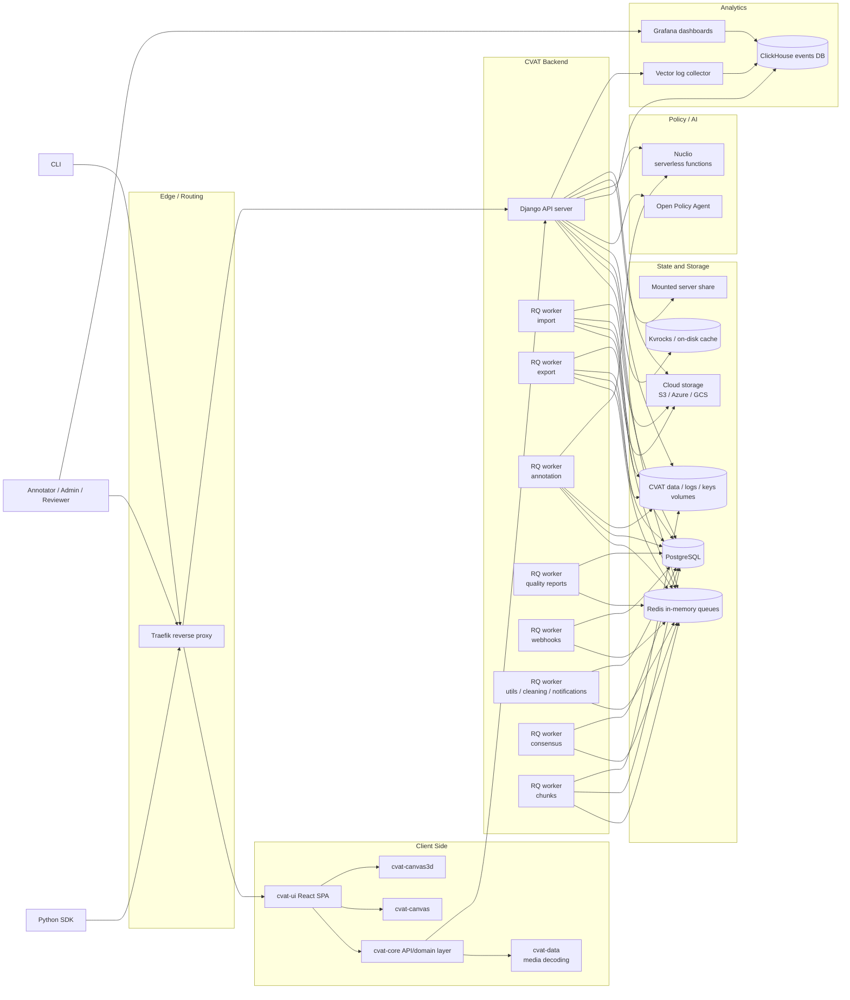
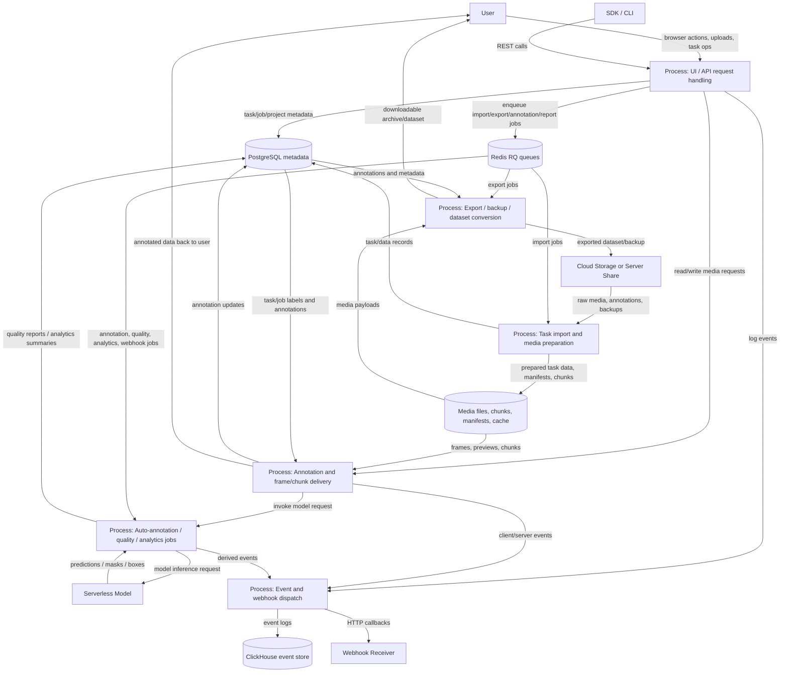
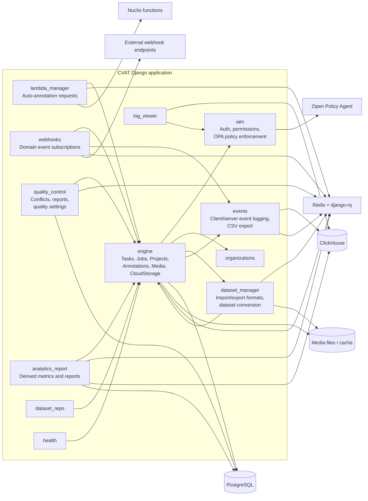
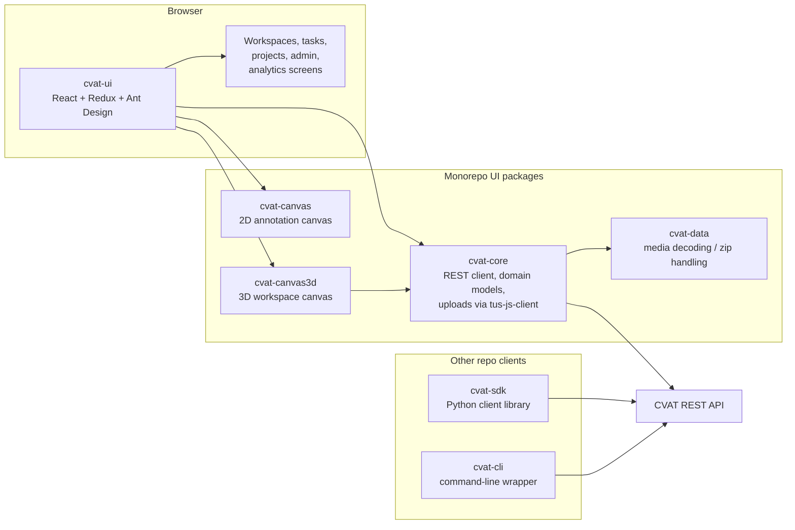

# CVAT Source Diagrams

These diagrams were derived from the current repository structure and runtime configuration, mainly from:

- `docker-compose.yml`
- `components/serverless/docker-compose.serverless.yml`
- `site/content/en/docs/contributing/repo-structure.md`
- `cvat/settings/base.py`
- `cvat/urls.py`
- `cvat/apps/engine/urls.py`
- `cvat/apps/lambda_manager/urls.py`
- `cvat/apps/events/views.py`
- `cvat-ui/package.json`
- `cvat-core/package.json`
- `cvat-canvas/package.json`
- `cvat-canvas3d/package.json`
- `cvat-data/package.json`

You can render these blocks directly in GitHub Markdown or in Mermaid Live.

## 1. Architecture Diagram

## 2. Data Flow Diagram

## 3. Backend Component Diagram

## 4. Frontend and Client Component Diagram

## Notes

- The main REST surface is centered in `cvat.apps.engine`, then extended by `iam`, `organizations`, `lambda_manager`, `events`, `webhooks`, `quality_control`, and `analytics_report`.
- Queue-backed operations are first-class in this source tree. Import, export, annotation, webhooks, quality reports, analytics reports, cleaning, and notifications all run through `django-rq`.
- Analytics is a separate path from transactional metadata. PostgreSQL stores application state; ClickHouse stores event logs and feeds Grafana dashboards and analytics reports.
- The frontend is intentionally split into reusable packages. `cvat-ui` is the SPA, while `cvat-core`, `cvat-data`, `cvat-canvas`, and `cvat-canvas3d` provide the main client-side layers underneath it.
