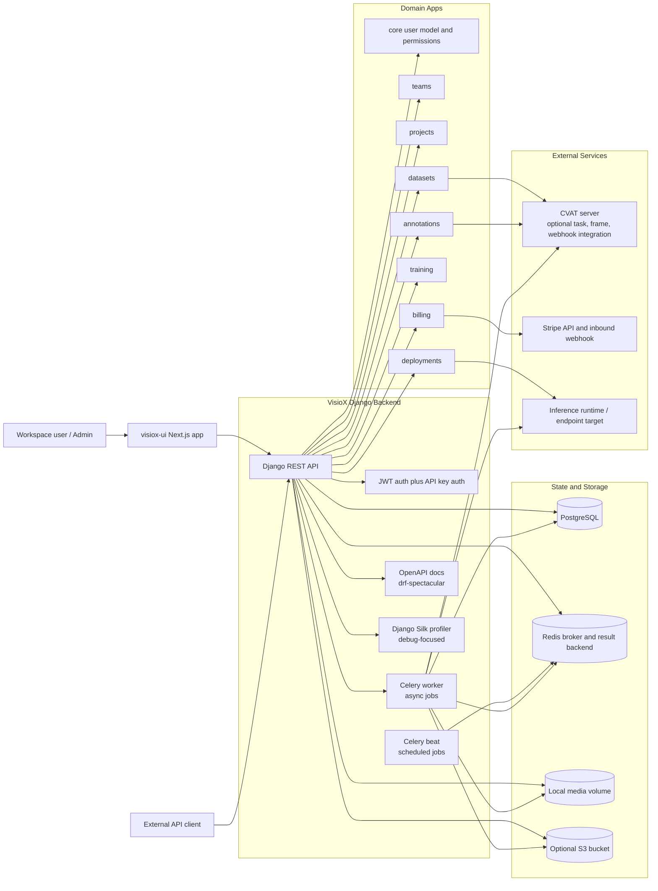
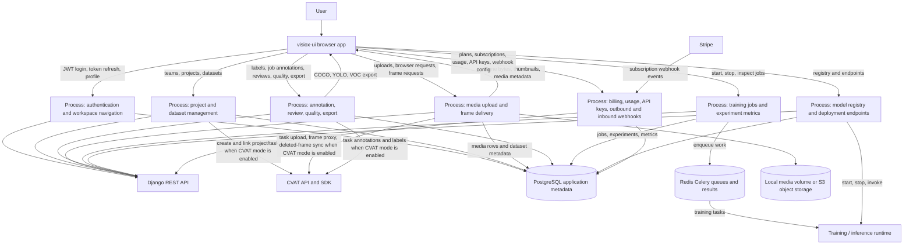
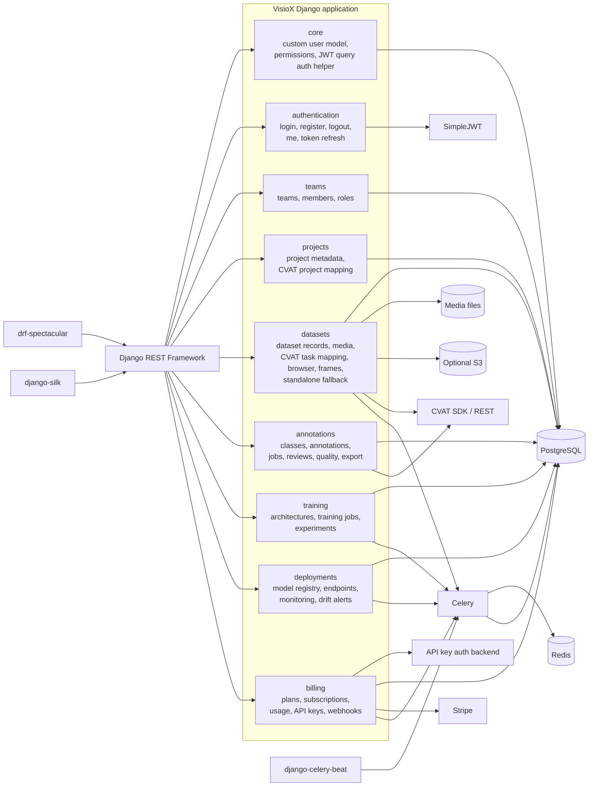
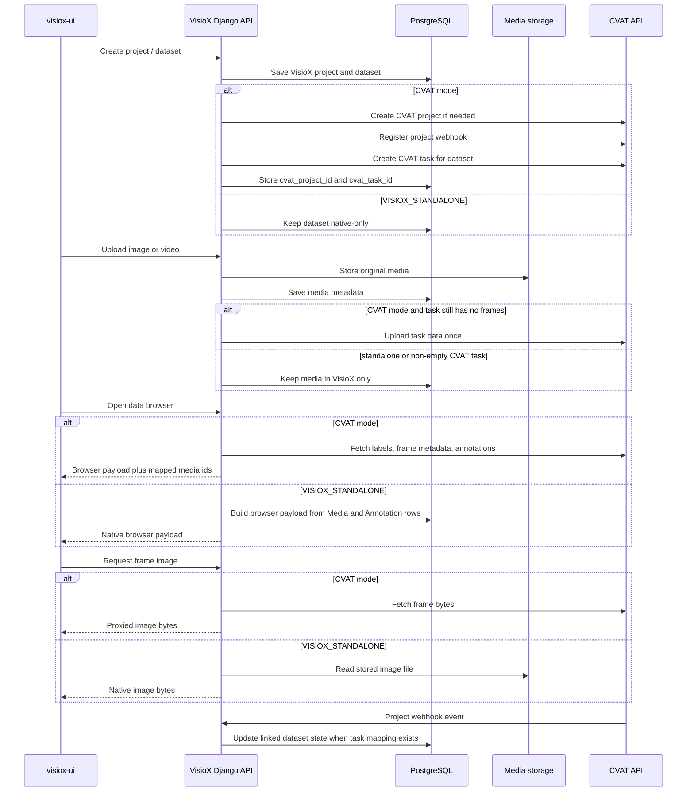

# VisioX Backend Source Diagrams

These diagrams were derived from the current VisioX Django repository structure and runtime configuration, mainly from:

- `docker-compose.yml`
- `requirements.txt`
- `visiox/settings.py`
- `visiox/urls.py`
- `visiox/celery.py`
- `authentication/urls.py`
- `teams/urls.py`
- `projects/urls.py`
- `datasets/urls.py`
- `datasets/views/dataset_view.py`
- `datasets/views/webhook_view.py`
- `datasets/services/cvat.py`
- `datasets/standalone.py`
- `annotations/urls.py`
- `annotations/views/task_view.py`
- `annotations/views/export_view.py`
- `annotations/views/quality_view.py`
- `training/urls.py`
- `deployments/urls.py`
- `billing/urls.py`
- `billing/backends.py`
- `core/jwt_query_auth.py`

They intentionally mirror the style of `cvat/ARCHITECTURE_DIAGRAMS.md`, but describe VisioX as the orchestration layer around its own Django API, local or S3 media storage, Celery workers, Stripe billing, and optional CVAT-backed annotation.

You can render these blocks directly in GitHub Markdown or in Mermaid Live.

## 1. Architecture Diagram



## 2. Data Flow Diagram



## 3. Backend Component Diagram



## 4. CVAT and Standalone Integration Diagram



## 5. API Surface Diagram

```mermaid
flowchart TB
    Root[/api/]
    Auth[/api/auth/]
    Teams[/api/teams/]
    Projects[/api/projects/]
    Datasets[/api/datasets/]
    Classes[/api/classes/]
    Annotations[/api/annotations/]
    Tasks[/api/tasks/ and /api/jobs/]
    Reviews[/api/reviews/]
    Training[/api/architectures/, /api/training-jobs/, /api/experiments/]
    Deploy[/api/registry/, /api/endpoints/, /api/monitoring/, /api/drift-alerts/]
    Billing[/api/plans/, /api/subscriptions/, /api/usage/, /api/api-keys/, /api/webhooks/]
    Docs[/api/schema/, /api/docs/, /api/redoc/]

    Root --> Auth
    Root --> Teams
    Root --> Projects
    Root --> Datasets
    Root --> Classes
    Root --> Annotations
    Root --> Tasks
    Root --> Reviews
    Root --> Training
    Root --> Deploy
    Root --> Billing
    Root --> Docs

    Datasets --> AnnotateURL[/api/datasets/{id}/annotate_url/]
    Datasets --> Stats[/api/datasets/{id}/stats/]
    Datasets --> Media[/api/datasets/{id}/media/]
    Datasets --> Upload[/api/datasets/{id}/upload/]
    Datasets --> UploadBatch[/api/datasets/{id}/upload-batch/]
    Datasets --> DeleteMedia[/api/datasets/{id}/delete-media/]
    Datasets --> Browser[/api/datasets/{id}/browser/]
    Datasets --> Frames[/api/datasets/{id}/frames/{frame}/]
    Datasets --> FrameAnnotations[/api/datasets/{id}/frames/{frame}/annotations/]
    Datasets --> Export[/api/datasets/{id}/export/]
    Datasets --> Quality[/api/datasets/{id}/quality/]
    Datasets --> Sync[/api/datasets/{id}/sync_cvat/]
    Datasets --> Repair[/api/datasets/repair-cvat/]
    Datasets --> CVATWebhook[/api/datasets/cvat-webhook/]

    Tasks --> TaskAnnotations[/api/tasks/{id}/annotations/]
    Tasks --> TaskIssues[/api/tasks/{id}/issues/]
    Tasks --> TaskLifecycle[/api/tasks/{id}/start|complete|submit_for_review|approve|reject/]

    Reviews --> ReviewActions[/api/reviews/{id}/approve|reject|request_revision/]
    Billing --> StripeWebhook[/api/webhooks/stripe/]
```

## Agent Constraints

- Treat this file as a source-guided summary, not a product roadmap. Do not add boxes, arrows, services, or endpoints unless they exist in the codebase or are explicitly marked as future work elsewhere.
- Keep the distinction between `VISIOX_STANDALONE` and CVAT-enabled mode explicit. The backend supports both, and diagrams should not imply that CVAT is always required.
- Keep `visiox-ui`, `visiox`, and `cvat` separated by responsibility. VisioX is not a CVAT fork and should not be documented as if annotation, auth, or billing live inside CVAT.
- Reflect route ownership accurately. Dataset browser, frame proxy, repair, and CVAT webhook behavior live under `datasets`, while job/task annotation lifecycle lives under `annotations`.
- Do not collapse authentication into JWT only. The REST framework also includes API key authentication, and some image endpoints accept JWT via query token patterns.
- When documenting background work, keep Celery usage conservative. Show it where code clearly uses async tasks or scheduled jobs; do not infer unimplemented pipelines.
- Prefer stable nouns from code over marketing language. Examples: `training-jobs`, `experiments`, `registry`, `drift-alerts`, `api-keys`, `webhooks`.
- If a diagram becomes ambiguous, favor notes over invented detail. A short note about optional behavior is better than a confident but inaccurate arrow.

## Notes

- VisioX is not a CVAT fork. It is a Django product API that can use CVAT as an optional annotation engine while keeping projects, datasets, users, billing, training, and deployments in its own domain model.
- PostgreSQL stores transactional state. Redis is used by Celery as the broker and result backend. Media is local by default and can move to S3 through `USE_S3=true`.
- The current Docker Compose stack runs `db`, `redis`, `api`, `worker`, and `beat`. CVAT is expected to run separately and is reached through `CVAT_HOST` and `CVAT_PUBLIC_URL`.
- CVAT integration is concentrated in `datasets/services/cvat.py`, with project/task provisioning, one-time task data upload, browser payload assembly, frame proxying, deleted-frame sync, orphan repair, and webhook registration.
- The API root wires app routers under `/api/`, while auth is mounted at `/api/auth/` and docs are exposed at `/api/schema/`, `/api/docs/`, and `/api/redoc/`.
