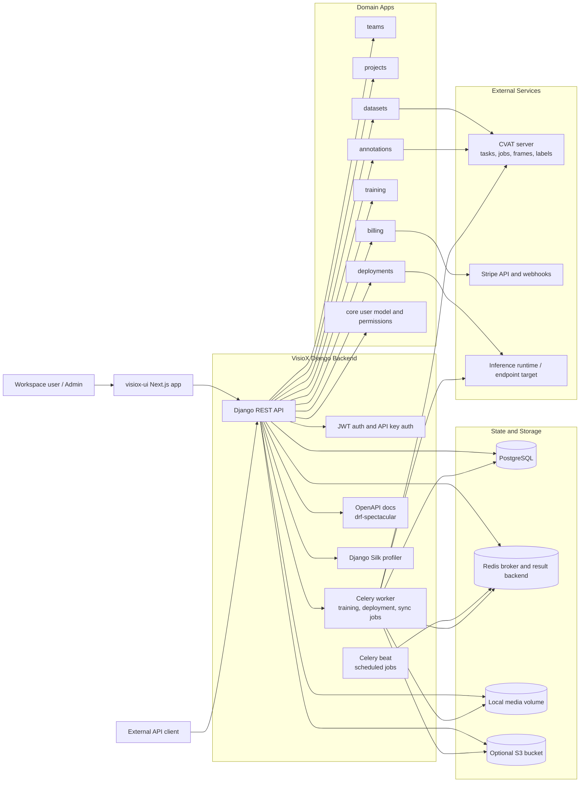
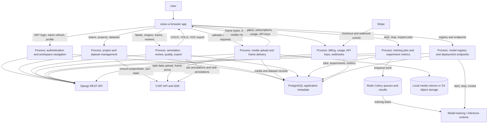
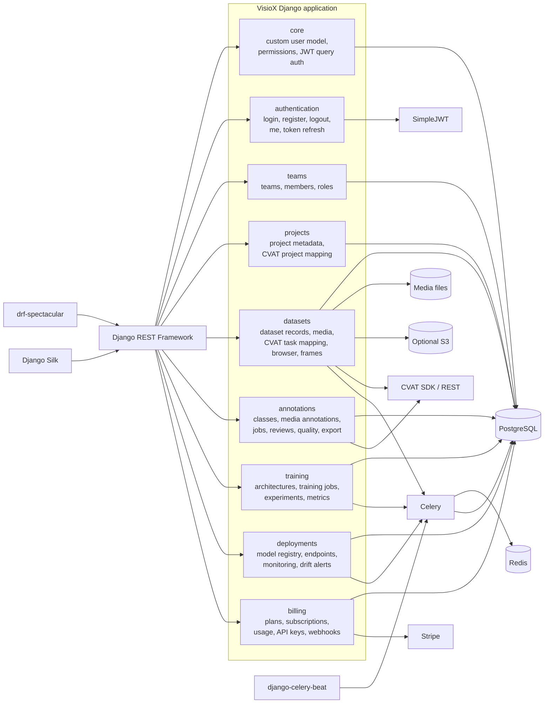
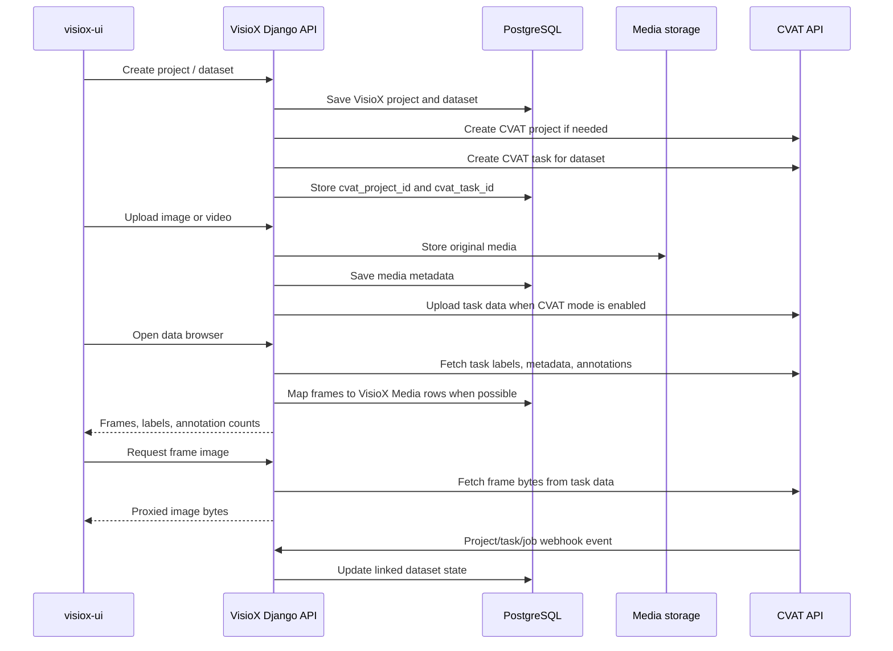

# VisioX Backend Source Diagrams

These diagrams were derived from the current VisioX Django repository structure and runtime configuration, mainly from:

- `docker-compose.yml`
- `requirements.txt`
- `visiox/settings.py`
- `visiox/urls.py`
- `visiox/celery.py`
- `authentication/urls.py`
- `teams/urls.py`
- `projects/urls.py`
- `datasets/urls.py`
- `datasets/services/cvat.py`
- `annotations/urls.py`
- `training/urls.py`
- `deployments/urls.py`
- `billing/urls.py`

They intentionally mirror the style of `cvat/ARCHITECTURE_DIAGRAMS.md`, but describe VisioX as the orchestration layer around its own Django API, local or S3 media storage, Celery workers, Stripe billing, and optional CVAT-backed annotation.

You can render these blocks directly in GitHub Markdown or in Mermaid Live.

## 1. Architecture Diagram



## 2. Data Flow Diagram



## 3. Backend Component Diagram



## 4. CVAT Integration Diagram



## 5. API Surface Diagram

```mermaid
flowchart TB
    Root[/api/]
    Auth[/api/auth/]
    Teams[/api/teams/]
    Projects[/api/projects/]
    Datasets[/api/datasets/]
    Annotations[/api/annotations/ and /api/classes/]
    Jobs[/api/jobs/ and /api/tasks/]
    Training[/api/architectures/ and /api/training-jobs/]
    Deploy[/api/registry/ and /api/endpoints/]
    Billing[/api/plans/, subscriptions, usage, api-keys, webhooks]
    Docs[/api/schema/, /api/docs/, /api/redoc/]

    Root --> Auth
    Root --> Teams
    Root --> Projects
    Root --> Datasets
    Root --> Annotations
    Root --> Jobs
    Root --> Training
    Root --> Deploy
    Root --> Billing
    Root --> Docs

    Datasets --> Browser[/api/datasets/{id}/browser/]
    Datasets --> Frames[/api/datasets/{id}/frames/{frame}/]
    Datasets --> Export[/api/datasets/{id}/export/]
    Datasets --> Sync[/api/datasets/{id}/sync_cvat/]
    Datasets --> Webhook[/api/datasets/cvat-webhook/]
    Jobs --> JobAnnotations[/api/jobs/{id}/annotations/]
    Jobs --> JobIssues[/api/jobs/{id}/issues/]
```

## Notes

- VisioX is not a CVAT fork. It is a product API that uses CVAT as an optional annotation engine while keeping VisioX projects, datasets, users, billing, training, and deployments in its own Django domain model.
- PostgreSQL stores transactional state. Redis is used by Celery as the broker and result backend. Media is local by default and can move to S3 through `USE_S3`.
- CVAT integration is concentrated in `datasets/services/cvat.py`, with project/task provisioning, task data upload, frame proxying, task stats, browser data, and webhook registration.
- The current Docker Compose stack runs Django API, Celery worker, Celery beat, PostgreSQL, and Redis. CVAT is expected to run separately and is reached through `CVAT_HOST` / `CVAT_PUBLIC_URL`.
