# VisioX Backend — Architecture Diagrams

Derived from the current `visiox` repository. Render in GitHub Markdown or [Mermaid Live](https://mermaid.live).

Source files:
- `docker-compose.yml`, `requirements.txt`, `visiox/settings.py`, `visiox/urls.py`, `visiox/celery.py`
- `core/`, `authentication/`, `teams/`, `projects/`, `datasets/`, `annotations/`
- `training/`, `deployments/`, `billing/`, `dataverse/`
- `datasets/services/cvat.py`, `datasets/standalone.py`
- `billing/backends.py`, `core/jwt_query_auth.py`

---

## 0. Current Physical Deployment

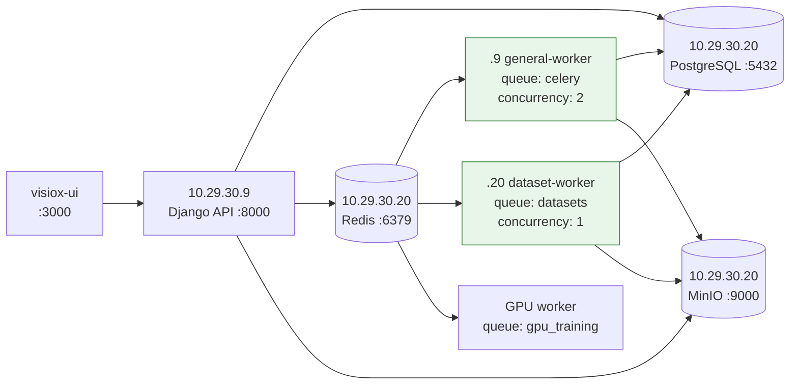

The Django workers use `Dockerfile.worker` and run as `uid=10001(visiox)`.
The `.20` infrastructure stack uses Compose project `infiniq`. Worker node
suffixes are dynamic container IDs, not stable hostnames.

---

## 1. System Architecture

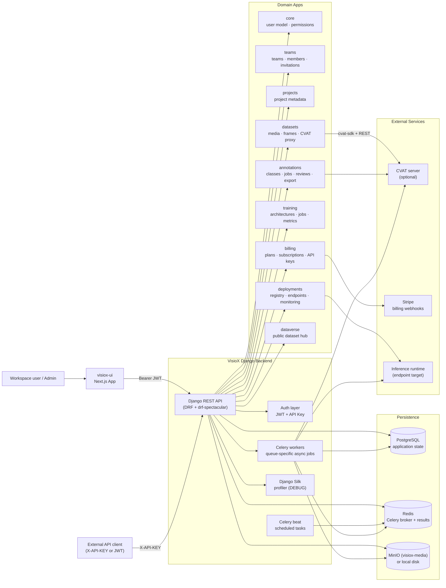

---

## 2. Three-Repo Integration

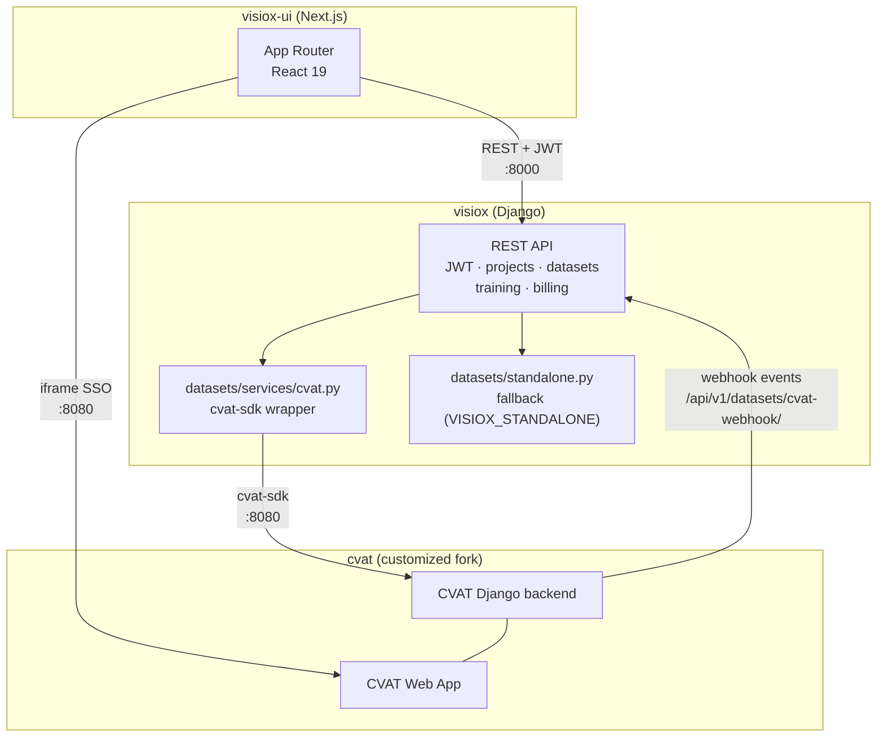

---

## 3. Authentication Flow

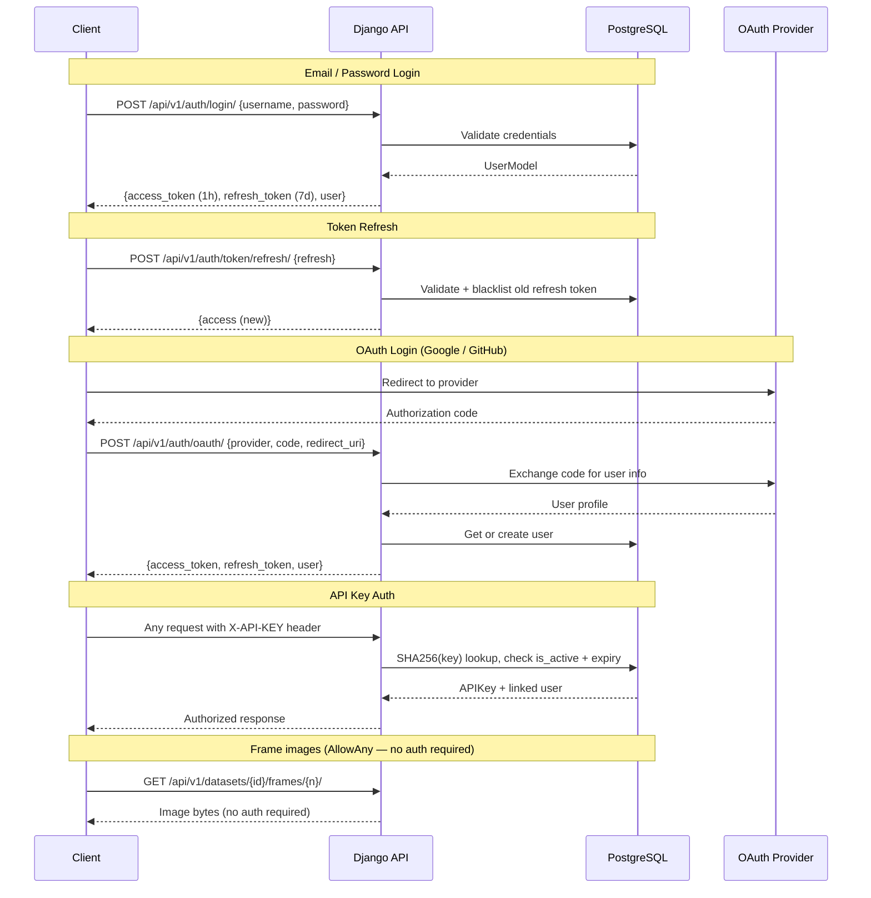

---

## 4. CVAT Integration & Standalone Mode

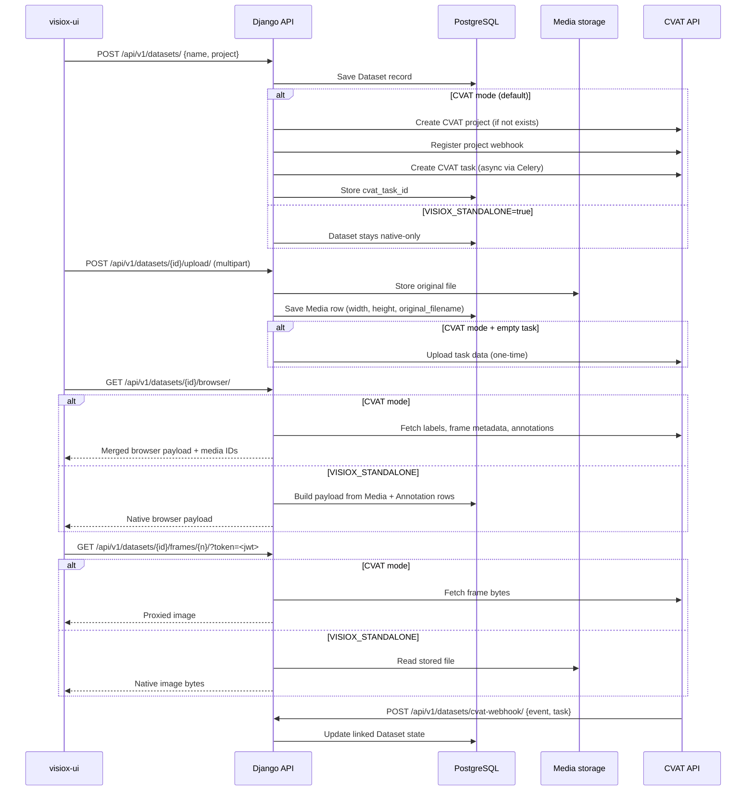

---

## 5. Annotation Job Lifecycle

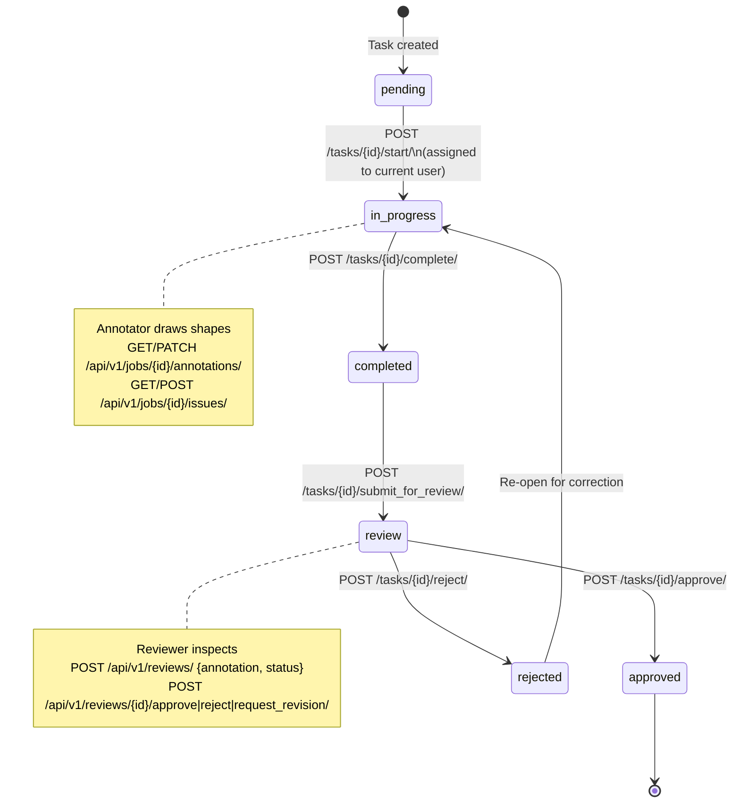

---

## 6. Data Flow

---

## 7. Backend Component Diagram

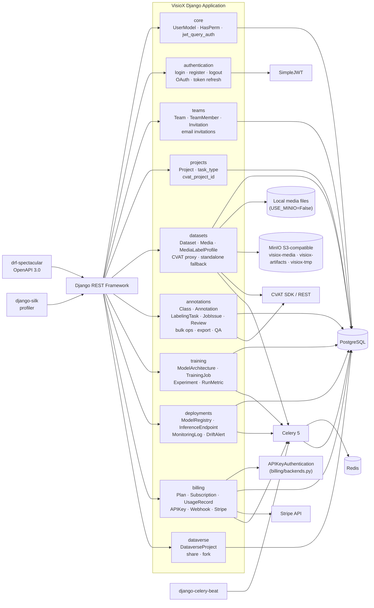

---

## 8. Celery Background Tasks

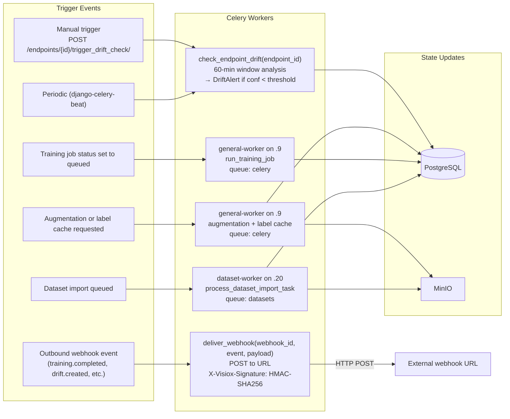

---

## 9. API Surface

```mermaid
flowchart TB
    Root["/api/v1/"]

    Root --> AuthR["/api/v1/auth/\nlogin · register · logout · me · oauth · token/refresh"]
    Root --> TeamsR["/api/v1/teams/ · /api/v1/invitations/\nCRUD + members + email invitations"]
    Root --> ProjectsR["/api/v1/projects/\nCRUD"]
    Root --> DatasetsR["/api/v1/datasets/"]
    Root --> AnnR["/api/v1/classes/ · /api/v1/annotations/\n/api/v1/tasks/ · /api/v1/jobs/ · /api/v1/reviews/"]
    Root --> TrainR["/api/v1/architectures/ · /api/v1/training-jobs/ · /api/v1/experiments/"]
    Root --> DeployR["/api/v1/registry/ · /api/v1/endpoints/\n/api/v1/monitoring/ · /api/v1/drift-alerts/"]
    Root --> BillingR["/api/v1/plans/ · /api/v1/subscriptions/ · /api/v1/usage/\n/api/v1/api-keys/ · /api/v1/webhooks/"]
    Root --> DataverseR["/api/v1/dataverse/"]
    Root --> DocsR["/api/schema/ · /api/docs/ · /api/redoc/"]

    DatasetsR --> DS1["/api/v1/datasets/{id}/annotate_url/"]
    DatasetsR --> DS2["/api/v1/datasets/{id}/browser/"]
    DatasetsR --> DS3["/api/v1/datasets/{id}/frames/{n}/\n(JWT header or ?token=)"]
    DatasetsR --> DS4["/api/v1/datasets/{id}/upload/ · /upload_batch/"]
    DatasetsR --> DS5["/api/v1/datasets/{id}/delete_media/"]
    DatasetsR --> DS6["/api/v1/datasets/{id}/stats/ · /sync_cvat/ · /export/"]
    DatasetsR --> DS7["/api/v1/datasets/cvat-webhook/\n(AllowAny)"]

    AnnR --> AN1["/api/v1/media/{id}/annotations/\n(GET · PUT — full snapshot)"]
    AnnR --> AN2["/api/v1/media/{id}/label-profile/"]
    AnnR --> AN3["/api/v1/jobs/{id}/annotations/\n(GET · PATCH)"]
    AnnR --> AN4["/api/v1/jobs/{id}/issues/"]
    AnnR --> AN5["/api/v1/jobs/{id}/start|complete\n|submit_for_review|approve|reject/"]
    AnnR --> AN6["/api/v1/datasets/{id}/quality/\n/api/v1/media/{id}/quality/"]

    BillingR --> B1["/api/v1/webhooks/stripe/\n(AllowAny)"]
    DataverseR --> DV1["/api/v1/dataverse/share-project/\n/api/v1/dataverse/{id}/fork/"]
```

---

## 10. Billing & Stripe Flow

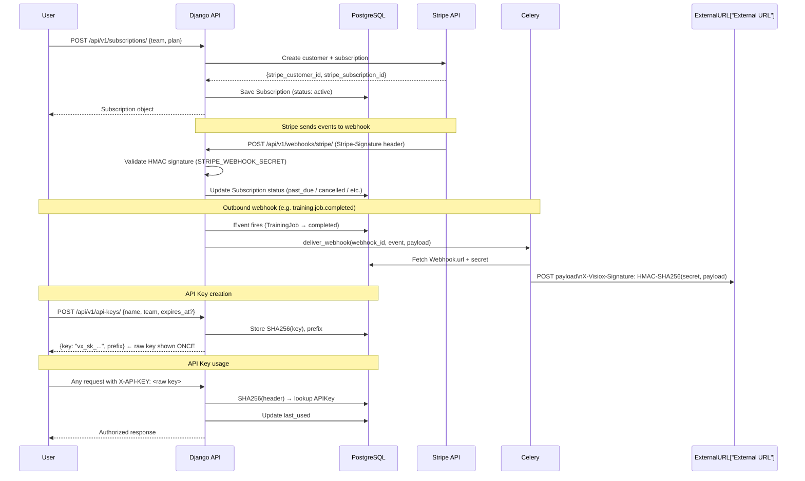

---

## 11. DataVerse Fork Flow

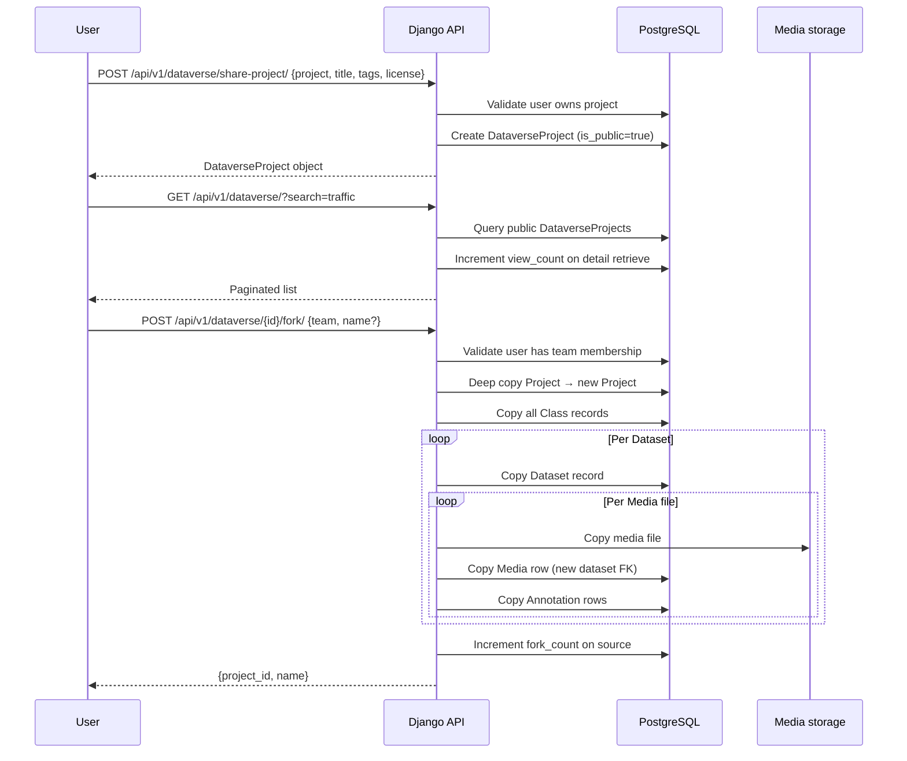

---

## 12. MinIO Storage Architecture

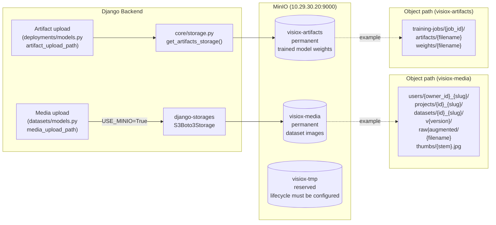

**Environment variables (`.env`):**

| Variable | Example | Purpose |
| --- | --- | --- |
| `USE_MINIO` | `True` | Enable MinIO storage backend |
| `MINIO_ENDPOINT` | `http://10.29.30.20:9000` | MinIO server URL |
| `MINIO_ACCESS_KEY` | `<service-account>` | Scoped MinIO service account |
| `MINIO_SECRET_KEY` | `<service-account-secret>` | Secret; never commit or document the real value |
| `MINIO_BUCKET` | `visiox-media` | Default bucket for media uploads |

**Management commands for data migration:**

| Command | Purpose |
| --- | --- |
| `migrate_to_minio` | Local disk → MinIO `visiox-data/teams/` |
| `migrate_to_new_structure` | `visiox-data/teams/{id}/` → `visiox-media/orgs/{id}/v{version}/` |
| `migrate_to_slug_paths` | `orgs/{id}/` → `orgs/{id}_{slug}/` (human-readable rename) |

---

## Agent Constraints

- Do not add boxes, arrows, or endpoints unless they exist in the codebase or are explicitly marked as future work.
- Keep `VISIOX_STANDALONE` vs CVAT-enabled mode distinct — both are valid runtime configurations.
- `visiox-ui`, `visiox`, and `cvat` are three separate repos with separate responsibilities.
- `billing/backends.py` provides API key authentication — it is separate from JWT and should not be collapsed into it.
- When documenting background work, stay conservative: only show Celery tasks that exist in `tasks.py` files.

## Notes

- PostgreSQL stores all transactional state. Redis is the Celery broker and result backend. Media is local by default; set `USE_MINIO=True` in `.env` to route all uploads to MinIO (`MINIO_ENDPOINT`).
- MinIO buckets: `visiox-media` stores media/import staging/derived labels; `visiox-artifacts` stores trained model artifacts; `visiox-tmp` is reserved until a verified lifecycle is configured. Media paths use `users/{owner_id}_{slug}/projects/{id}_{slug}/datasets/{id}_{slug}/v{version}/{category}/{filename}`.
- Compose is split by host: `.9` runs `api`, `worker`, and `beat`; `.20` project `infiniq` runs `db`, `redis`, `minio`, and `worker-datasets`. CVAT runs separately and is reached via `CVAT_INTERNAL_HOST`.
- CVAT integration is concentrated in `datasets/services/cvat.py`. All provisioning, frame proxying, browser payload assembly, one-time data upload, deleted-frame sync, orphan repair, and webhook registration live there.
- `VISIOX_STANDALONE=true` disables all CVAT calls and falls back to `datasets/standalone.py` for browser data and frame delivery.
- The outbound webhook system (`billing/`) fires events like `training.job.completed` and `deployment.drift_alert.created` via Celery, signed with HMAC-SHA256.
