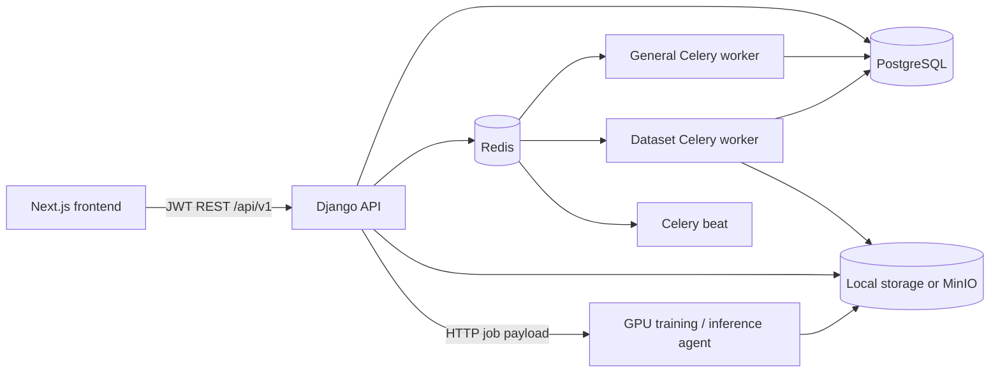
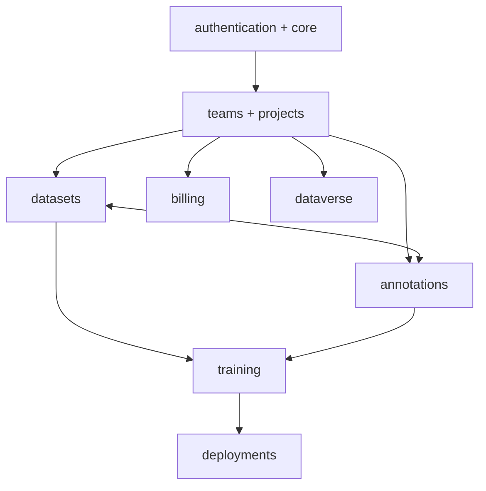
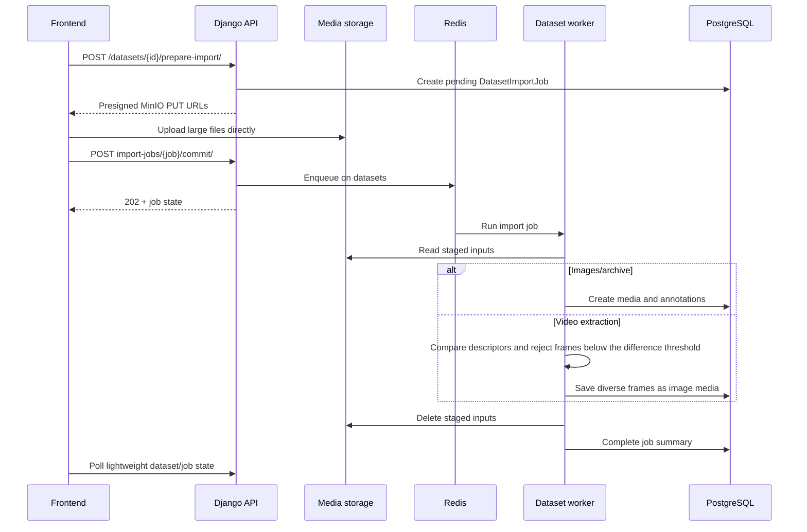
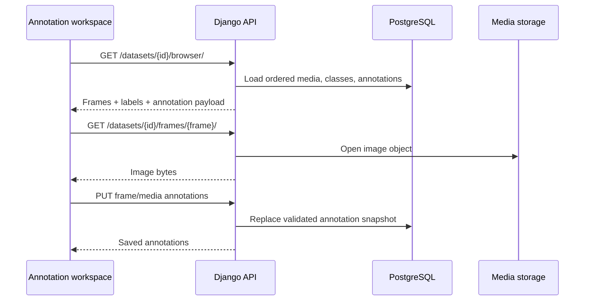
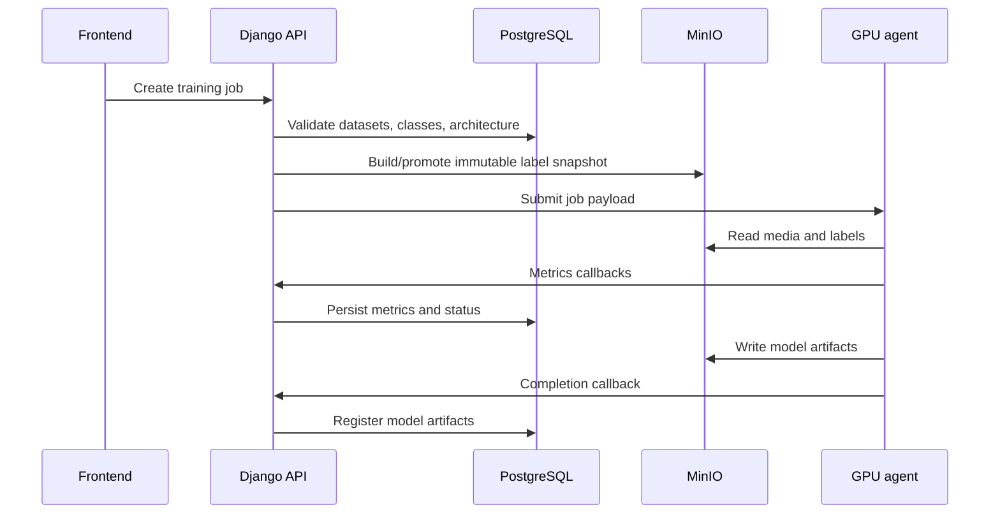

# VisioX Architecture Diagrams

This document describes the current native VisioX architecture. PostgreSQL is
the source of truth for metadata and annotations; media and artifacts are stored
locally in development or in MinIO for shared deployments.

## Runtime topology



Shared deployment ownership:

| Host | Services |
| --- | --- |
| API host (`10.29.30.9`) | Django API, general worker, Celery beat |
| Data host (`10.29.30.20`) | PostgreSQL, Redis, MinIO, dataset worker |
| GPU host | Training and inference agents |

## Backend modules



- `datasets/services/media_browser.py` builds native frame/browser payloads.
- `datasets/services/video_extraction.py` selects visually diverse video frames.
- `datasets/services/splitting.py` owns train/validation/test assignment.
- `training/services/` owns artifact and fine-tuning support logic.
- `core/storage.py` selects local or MinIO-compatible storage.

## Dataset import flow



Long-running imports must remain on the `datasets` queue. Storage operations
must work with both Django filesystem storage and S3-compatible MinIO storage.

## Native annotation flow



Frame image endpoints accept the normal Bearer header and the narrowly scoped
query-token authentication required by browser image elements.

## Training flow



Class order is captured in the training job schema and must use the explicit
project class index. Canonical media is never rearranged into physical split
folders; PostgreSQL split metadata and immutable label snapshots define the run.

## Storage layout

```text
visiox-media/
  users/{owner}_{slug}/projects/{project}_{slug}/datasets/{dataset}_{slug}/
    v{version}/raw/...
    v{version}/augmented/...
  import-staging/datasets/{dataset_id}/jobs/{job_id}/...
  training-cache/datasets/{dataset_id}/revisions/{revision}/...
  training-jobs/{job_id}/labels/{split}/...

visiox-artifacts/
  training-jobs/{job_id}/weights/...
  training-jobs/{job_id}/plots/...
```

Never expose MinIO credentials to the frontend. API responses provide protected
application endpoints or time-limited storage URLs as appropriate.

## Queue ownership

| Queue | Work |
| --- | --- |
| `celery` | General background work, augmentation, cache cleanup |
| `datasets` | Dataset imports and video frame extraction |
| `gpu_training` | GPU-host training execution where configured |

Dataset and general workers use `Dockerfile.worker`. The data-host Compose stack
uses project name `infiniq`; operational commands must include `-p infiniq`.
