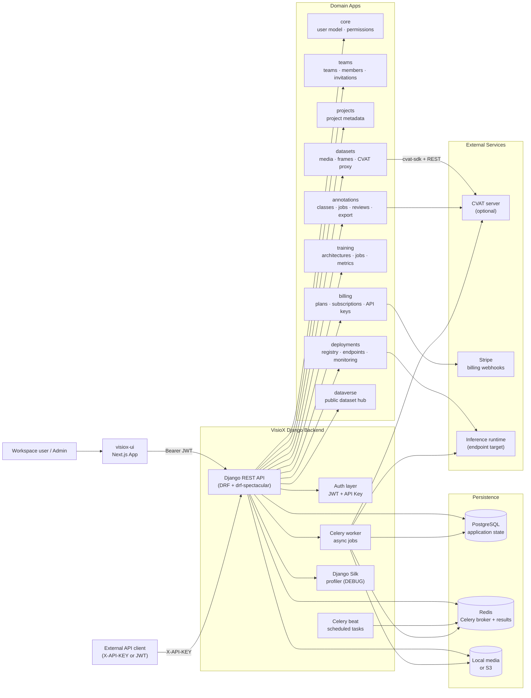
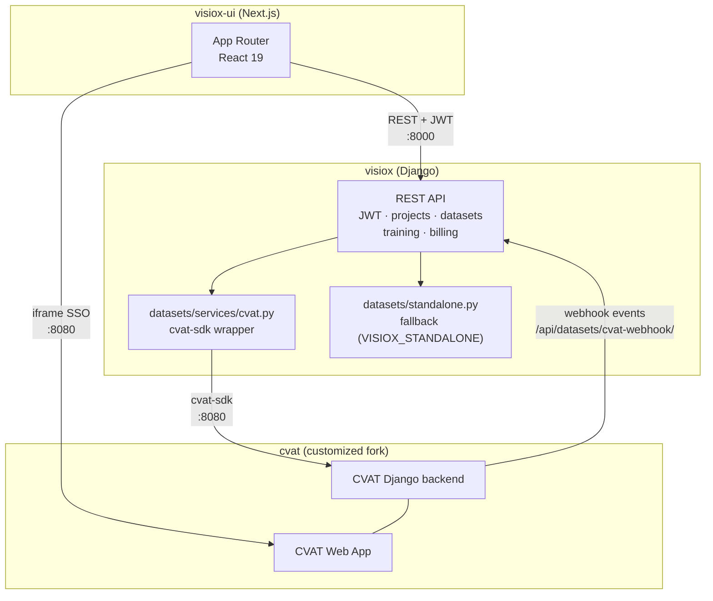
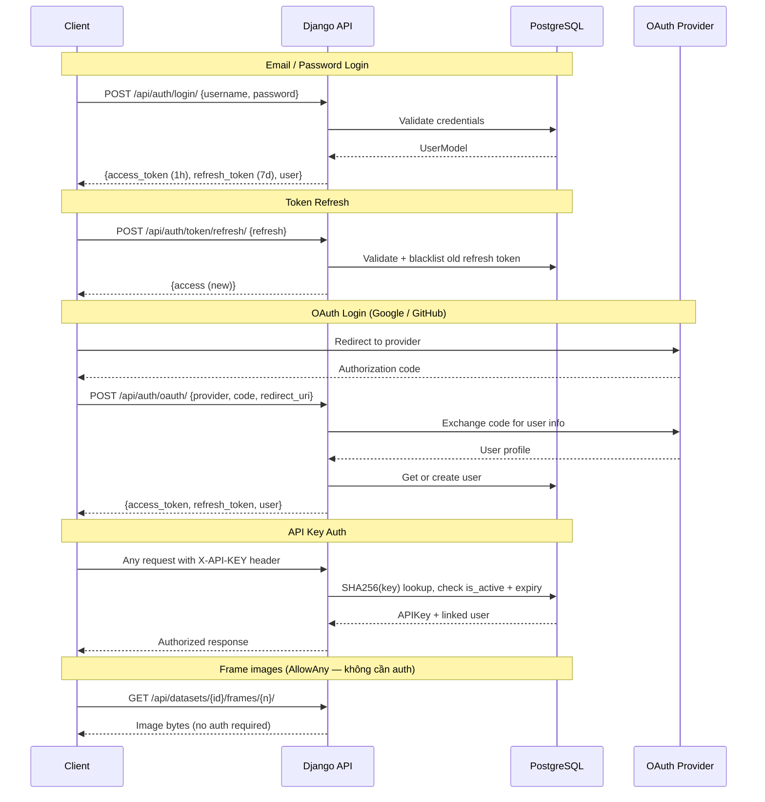
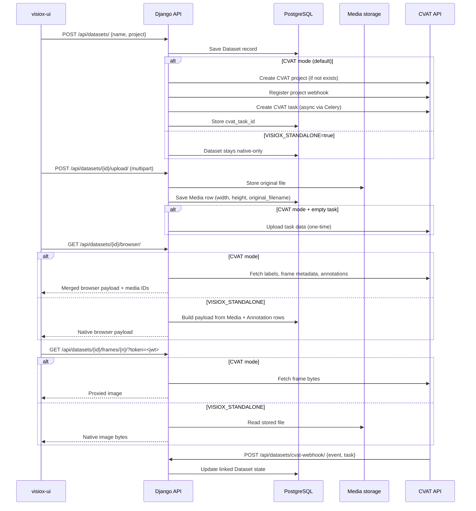
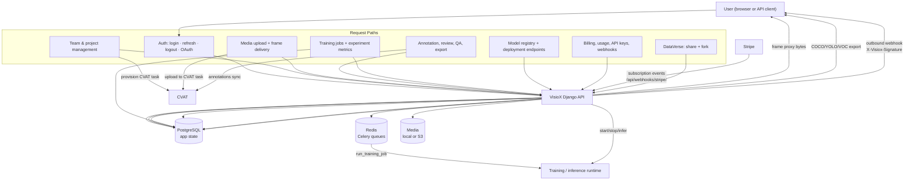
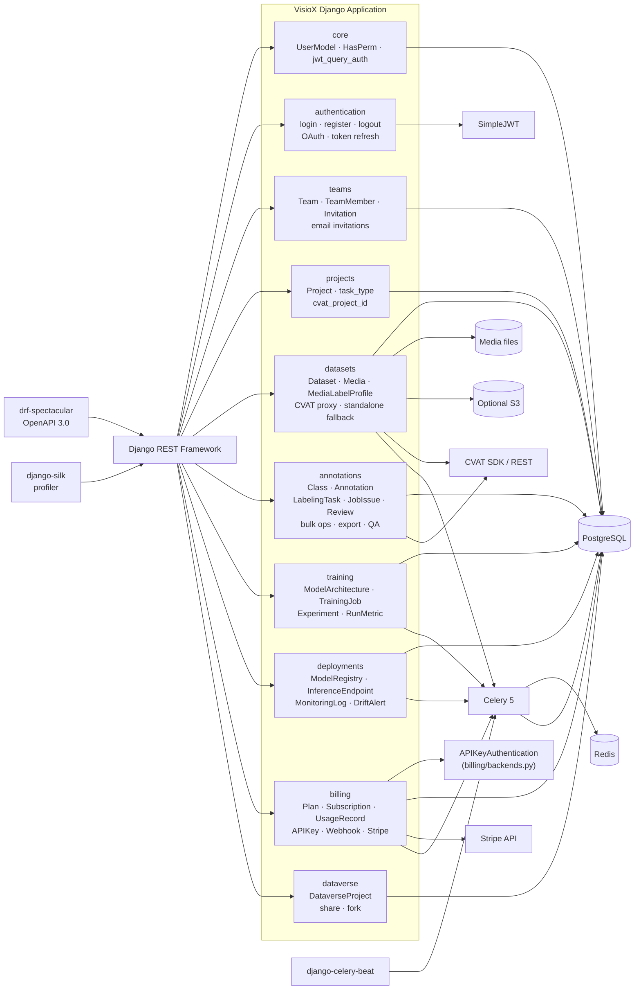
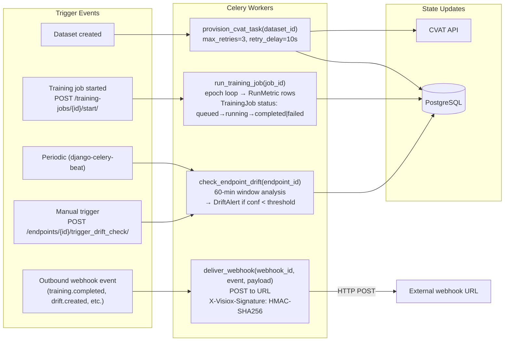
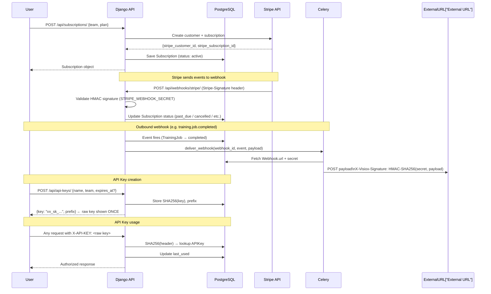
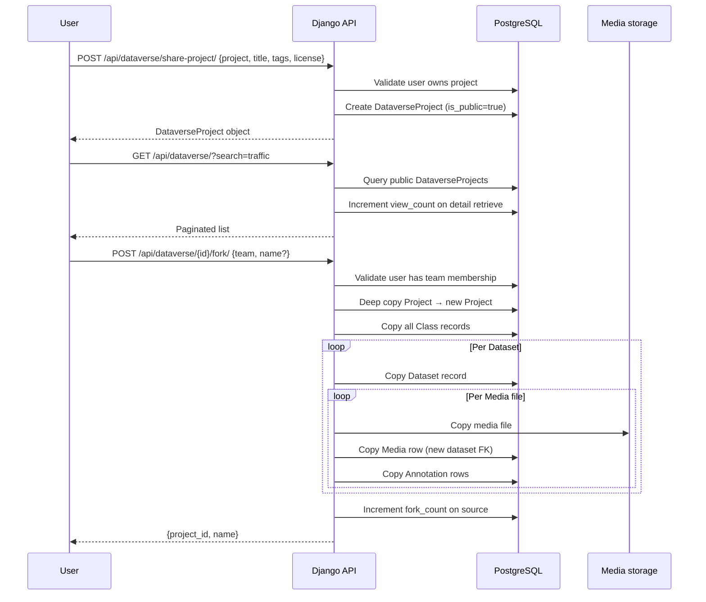

# VisioX Backend — Architecture Diagrams

Derived from the current `visiox` repository. Render in GitHub Markdown or [Mermaid Live](https://mermaid.live).

Source files:
- `docker-compose.yml`, `requirements.txt`, `visiox/settings.py`, `visiox/urls.py`, `visiox/celery.py`
- `core/`, `authentication/`, `teams/`, `projects/`, `datasets/`, `annotations/`
- `training/`, `deployments/`, `billing/`, `dataverse/`
- `datasets/services/cvat.py`, `datasets/standalone.py`
- `billing/backends.py`, `core/jwt_query_auth.py`

---

## 1. System Architecture

---

## 2. Three-Repo Integration

---

## 3. Authentication Flow

---

## 4. CVAT Integration & Standalone Mode

---

## 5. Annotation Job Lifecycle

---

## 6. Data Flow

---

## 7. Backend Component Diagram

---

## 8. Celery Background Tasks

---

## 9. API Surface

```mermaid
flowchart TB
    Root["/api/"]

    Root --> AuthR["/api/auth/\nlogin · register · logout · me · oauth · token/refresh"]
    Root --> TeamsR["/api/teams/ · /api/invitations/\nCRUD + members + email invitations"]
    Root --> ProjectsR["/api/projects/\nCRUD"]
    Root --> DatasetsR["/api/datasets/"]
    Root --> AnnR["/api/classes/ · /api/annotations/\n/api/tasks/ · /api/jobs/ · /api/reviews/"]
    Root --> TrainR["/api/architectures/ · /api/training-jobs/ · /api/experiments/"]
    Root --> DeployR["/api/registry/ · /api/endpoints/\n/api/monitoring/ · /api/drift-alerts/"]
    Root --> BillingR["/api/plans/ · /api/subscriptions/ · /api/usage/\n/api/api-keys/ · /api/webhooks/"]
    Root --> DataverseR["/api/dataverse/"]
    Root --> DocsR["/api/schema/ · /api/docs/ · /api/redoc/"]

    DatasetsR --> DS1["/api/datasets/{id}/annotate_url/"]
    DatasetsR --> DS2["/api/datasets/{id}/browser/"]
    DatasetsR --> DS3["/api/datasets/{id}/frames/{n}/\n(AllowAny, ?token= support)"]
    DatasetsR --> DS4["/api/datasets/{id}/upload/ · /upload_batch/"]
    DatasetsR --> DS5["/api/datasets/{id}/delete_media/"]
    DatasetsR --> DS6["/api/datasets/{id}/stats/ · /sync_cvat/ · /export/"]
    DatasetsR --> DS7["/api/datasets/cvat-webhook/\n(AllowAny)"]

    AnnR --> AN1["/api/media/{id}/annotations/\n(GET · PUT — full snapshot)"]
    AnnR --> AN2["/api/media/{id}/label-profile/"]
    AnnR --> AN3["/api/jobs/{id}/annotations/\n(GET · PATCH)"]
    AnnR --> AN4["/api/jobs/{id}/issues/"]
    AnnR --> AN5["/api/jobs/{id}/start|complete\n|submit_for_review|approve|reject/"]
    AnnR --> AN6["/api/datasets/{id}/quality/\n/api/media/{id}/quality/"]

    BillingR --> B1["/api/webhooks/stripe/\n(AllowAny)"]
    DataverseR --> DV1["/api/dataverse/share-project/\n/api/dataverse/{id}/fork/"]
```

---

## 10. Billing & Stripe Flow

---

## 11. DataVerse Fork Flow

---

## Agent Constraints

- Do not add boxes, arrows, or endpoints unless they exist in the codebase or are explicitly marked as future work.
- Keep `VISIOX_STANDALONE` vs CVAT-enabled mode distinct — both are valid runtime configurations.
- `visiox-ui`, `visiox`, and `cvat` are three separate repos with separate responsibilities.
- `billing/backends.py` provides API key authentication — it is separate from JWT and should not be collapsed into it.
- When documenting background work, stay conservative: only show Celery tasks that exist in `tasks.py` files.

## Notes

- PostgreSQL stores all transactional state. Redis is the Celery broker and result backend. Media is local by default and can be moved to S3 via `USE_S3=true`.
- The Docker Compose stack runs `db`, `redis`, `api`, `worker`, and `beat`. CVAT runs separately and is reached via `CVAT_INTERNAL_HOST`.
- CVAT integration is concentrated in `datasets/services/cvat.py`. All provisioning, frame proxying, browser payload assembly, one-time data upload, deleted-frame sync, orphan repair, and webhook registration live there.
- `VISIOX_STANDALONE=true` disables all CVAT calls and falls back to `datasets/standalone.py` for browser data and frame delivery.
- The outbound webhook system (`billing/`) fires events like `training.job.completed` and `deployment.drift_alert.created` via Celery, signed with HMAC-SHA256.
