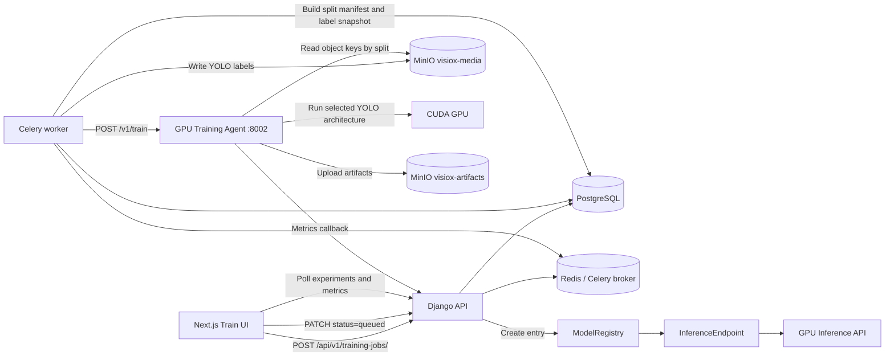
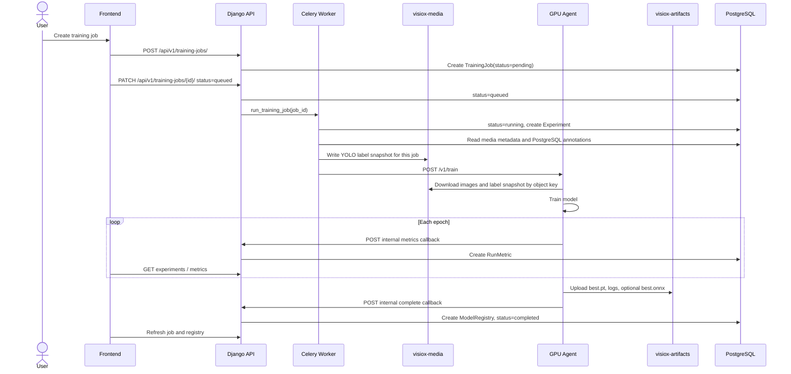
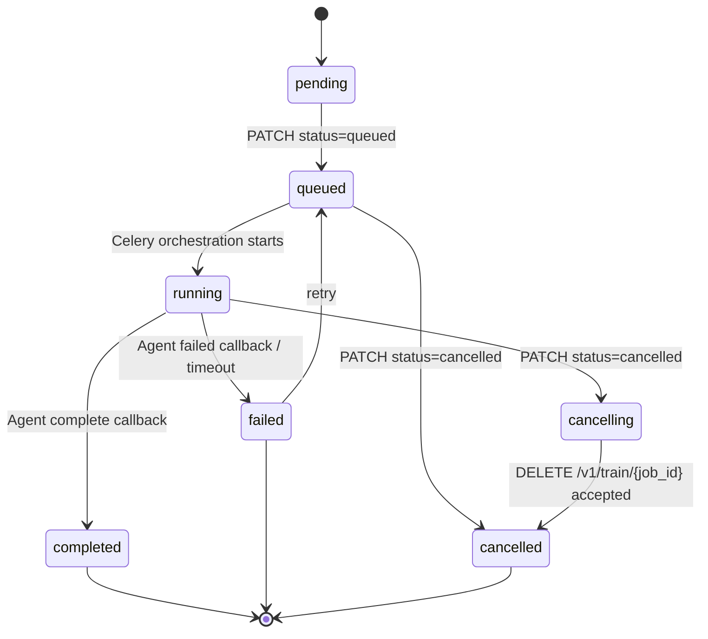
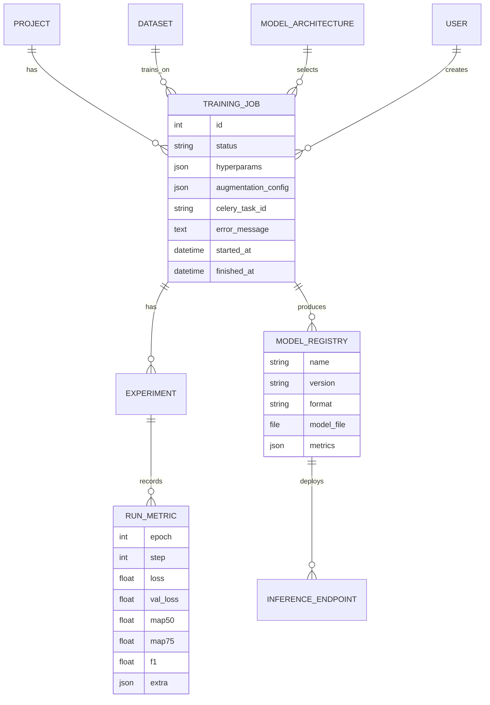

# Training Platform & GPU Agent Plan

This document defines the training direction for VisioX with a dedicated GPU machine on the LAN.

```text
GPU server: 192.168.210.26
Training Agent: http://192.168.210.26:8002
Inference API: future service, use another free port when enabled
```

The core decision is: **Django is the control plane** and **the GPU machine is the execution plane**. Django owns authentication, permissions, job state, dataset packaging, metrics, and the model registry. The GPU Agent owns CUDA/PyTorch/Ultralytics execution.

---

## Label Ownership & Delivery

PostgreSQL is the source of truth for annotations, classes, split membership, review state, and audit history. MinIO stores media objects plus derived training inputs and artifacts.

Training label flow:

```text
PostgreSQL annotations/classes
        |
        | verify/split background task renders cache
        v
visiox-media/training-cache/datasets/{dataset_id}/revisions/{dataset_revision}/labels/{split}/*.txt
        |
        | training start promotes immutable job copy
        v
visiox-media/training-jobs/{job_id}/labels/{split}/*.txt
        |
        | dataset.labels in POST /v1/train
        v
GPU Agent local YOLO workspace
```

Rules:

- MinIO `.txt` labels are derived files, not editable records.
- `training-cache/...` is a warm cache and may be replaced.
- `training-jobs/{job_id}/labels/...` is immutable for that run.
- Raw annotation changes or verification cancel clear the dataset cache and require re-verify before the next snapshot.

Runtime defaults:

```env
TRAINING_LABEL_DELIVERY=minio
TRAINING_LABEL_SOURCE=minio  # backward-compatible alias only
```

Use `TRAINING_LABEL_DELIVERY=postgres` only if the GPU server can safely reach PostgreSQL directly.

---

## Storage Namespace Policy

MinIO separates canonical media from run-scoped training outputs:

```text
visiox-media/
  users/{owner_id}_{owner_slug}/projects/{project_id}_{project_slug}/datasets/{dataset_id}_{dataset_slug}/v{version}/raw|augmented/...

visiox-media/
  training-jobs/{job_id}/labels/{split}/*.txt

visiox-artifacts/
  training-jobs/{job_id}/artifacts/*
```

Why `training-jobs/` stays flat:

- `users/...` answers ownership of canonical assets.
- `training-jobs/{job_id}` answers which exact run produced a snapshot or artifact.
- Job paths stay stable if a project is renamed, transferred, or later re-labeled.
- Flat job paths simplify callback handling, artifact upload, retention, and cleanup.

Optional readability refinement:

```text
visiox-artifacts/
  projects/{project_id}_{project_slug}/training-jobs/{job_id}/artifacts/*
```

If adopted later, Django should still store the final storage key instead of reconstructing it from user/project paths.

---

## Fast Label Sync Strategy

Use MinIO labels as a derived cache while PostgreSQL remains authoritative:

```text
PostgreSQL = canonical annotations/classes/review/split state
MinIO      = cached YOLO-ready label files for fast training startup
```

Django keeps a dataset-level cache instead of rendering every label file at training start:

```text
visiox-media/training-cache/datasets/{dataset_id}/
  revisions/{dataset_revision}/
    labels/train/*.txt
    labels/val/*.txt
    labels/test/*.txt
    manifest.json
    data.yaml
```

`dataset_revision` is derived from:

- `dataset.id`
- `dataset.verified_at`
- `dataset.split_updated_at`
- `dataset.split_config`
- completed augmentation timestamp
- ordered project class IDs

Sync flow:

1. `POST /api/v1/datasets/{id}/verify/` marks the dataset verified and enqueues cache refresh.
2. `POST /api/v1/datasets/{id}/split/` writes train/val/test metadata and enqueues cache refresh.
3. Raw annotation saves invalidate verification and enqueue cache clear.
4. `DELETE /api/v1/datasets/{id}/verify/` un-verifies the dataset, deletes generated augmented media, and enqueues cache clear.
5. `PATCH /api/v1/training-jobs/{id}/ {"status":"queued"}` promotes the current dataset cache into `training-jobs/{job_id}/labels/...` before calling the GPU Agent.

Why this model:

- training starts faster because labels are prebuilt,
- PostgreSQL stays queryable and authoritative,
- each job still gets an immutable snapshot.

Important rule: write annotations to PostgreSQL first, then sync MinIO after commit. Do not let the annotation UI treat MinIO as the source of truth.

---

## Sync Modes

### Mode A — Per-job snapshot only (current behavior)

- On `PATCH /api/v1/training-jobs/{id}/ {"status":"queued"}`, Django reads PostgreSQL and renders `training-jobs/{job_id}/labels/...`.
- Simple and correct.
- Slower when datasets are large because export cost is paid at job start.

### Mode B — Dataset cache + per-job freeze (current behavior)

- On verify and split, Django refreshes `training-cache/datasets/{dataset_id}/revisions/{dataset_revision}/...` in the background.
- On unverify or raw annotation change, Django clears `training-cache/datasets/{dataset_id}/`.
- When training starts, Django promotes the ready revision into `training-jobs/{job_id}/labels/...` as an immutable job snapshot.
- This preserves reproducibility while removing most of the waiting time.

Mode B is the preferred production design because it gives both:

- fast startup from prebuilt label files, and
- immutable per-job training evidence for debugging/reproducibility.

---

## Current State

| Area | Current status | Notes |
| --- | --- | --- |
| Training DB models | `ModelArchitecture`, `TrainingJob`, `Experiment`, `RunMetric` exist | Enough for job lifecycle and metrics |
| Training API | `/api/v1/architectures/`, `/api/v1/training-jobs/`, `/api/v1/experiments/` exist | Keep this public contract stable |
| Frontend | Train page can create/start jobs and poll metrics | Existing UI expects `queued`, `running`, `completed`, `failed`, `cancelled` |
| Celery task | Mock runner emits fake metrics | Replace with orchestration, not local GPU training |
| Dataset label cache | Verify/split can warm YOLO labels in `training-cache/...`; training promotes cache into job snapshots | Cache is derived from PostgreSQL and cleared when verification is cancelled or raw annotations change |
| Dataset export | COCO/YOLO/VOC/mask/keypoints exist | User download exports stay separate from train-ready cache/snapshots |
| Artifacts | `ModelRegistry.model_file` exists | Use it for `best.pt`; `best.onnx` can be added later |
| Backend DL deps | No PyTorch/Ultralytics | Keep backend lightweight |

---

## MVP Scope

MVP includes:

- YOLOv8, YOLOv9, YOLOv10, YOLOv11, and YOLO26 detection on a remote GPU agent
- YOLO-compatible train-ready dataset payload
- `best.pt`, `metrics.json`, and `training_log.json`
- automatic `ModelRegistry` creation
- compatibility with the existing `TrainingJob`, `Experiment`, and `RunMetric` frontend/API contract

Later phases may add `best.onnx`, RT-DETR, Faster R-CNN, DETR, TensorRT export, Triton, and multi-GPU scheduling. TensorRT is intentionally outside MVP because it depends on the deployment runtime.

---

## Architecture

### Deployed worker topology

Training orchestration tasks currently use the default `celery` queue and run
on the non-root `general-worker` on `.9` (concurrency `2`, prefetch `1`). The
separate non-root `dataset-worker` on `.20` listens only to `datasets` and does
not consume training orchestration. The GPU host exposes the training agent and
its GPU worker listens only to `gpu_training`.

PostgreSQL, Redis and MinIO run on `.20`. The general worker reaches them over
the LAN; the dataset worker uses Compose DNS (`db`, `redis`, `minio`). The
infrastructure Compose project is `infiniq`.

`TRAINING_CALLBACK_BASE_URL` must point to the API on `.9`, not the
infrastructure host:

```env
TRAINING_CALLBACK_BASE_URL=http://10.29.30.9:8000
```

Celery node suffixes change after container recreation. Operational checks
should use `inspect` without a hardcoded `--destination` unless the current node
name was discovered immediately beforehand.



---

## Training Sequence



---

## Job State Machine



Implementation notes:

- `queued`: user has started the job, but worker/agent may not have accepted it yet.
- `running`: backend has created an `Experiment` and the GPU Agent has accepted the job.
- `cancelling`: optional phase after MVP. MVP may set `cancelled` immediately after calling the agent cancel endpoint.
- `failed`: always set `error_message` so the frontend can show a useful reason.

---

## Data Model



---

## Public API Contract

Keep these endpoints stable because the frontend already uses them.

Dataset preparation endpoints:

```http
POST   /api/v1/datasets/{id}/verify/
DELETE /api/v1/datasets/{id}/verify/
POST   /api/v1/datasets/{id}/split/
POST   /api/v1/datasets/{id}/augmentations/
GET    /api/v1/datasets/{id}/augmentations/status/?job={augmentation_job_id}
```

Training endpoints:

```http
GET    /api/v1/architectures/
GET    /api/v1/training-jobs/
POST   /api/v1/training-jobs/
GET    /api/v1/training-jobs/{id}/
PATCH  /api/v1/training-jobs/{id}/
GET    /api/v1/training-jobs/{id}/experiments/
GET    /api/v1/experiments/{id}/metrics/
GET    /api/v1/datasets/{id}/export/?export_format=yolo&save_images=true
```

Verify labels:

```http
POST /api/v1/datasets/{id}/verify/
Content-Type: application/json

{"confirm_background_images": true}
```

Response: serialized `Dataset`. Side effect: after the database transaction commits, Django enqueues a dataset label-cache refresh. If background images exist and are not confirmed, the API returns `400` with `requires_background_confirmation: true`.

Cancel verification:

```http
DELETE /api/v1/datasets/{id}/verify/
```

Response: serialized `Dataset` plus `deleted_augmented_count`. Side effect: Django deletes augmented media for that dataset, clears augmentation jobs, invalidates training verification, and enqueues deletion of `training-cache/datasets/{dataset_id}/`.

Configure split:

```http
POST /api/v1/datasets/{id}/split/
Content-Type: application/json

{
  "train": 80,
  "val": 20,
  "test": 0,
  "seed": 42,
  "strategy": "class",
  "test_dataset_id": null
}
```

Response: `{ "dataset": ..., "summary": ... }`. Side effect: after the split metadata is saved, Django enqueues a dataset label-cache refresh for the new split revision.

Start job:

```http
PATCH /api/v1/training-jobs/{id}/
Content-Type: application/json

{"status": "queued"}
```

Side effect: Django promotes the latest dataset cache revision into `training-jobs/{job_id}/labels/...` before sending `POST /v1/train` to the GPU Agent. If the cache is absent or stale, Django rebuilds it synchronously from PostgreSQL and then promotes it.

Cancel job:

```http
PATCH /api/v1/training-jobs/{id}/
Content-Type: application/json

{"status": "cancelled"}
```

Cancel checks `training.stop_job` and asks the GPU Agent to stop the matching job.

There is no public cache-management endpoint in the MVP. Cache refresh/clear is intentionally driven by verified dataset state and raw annotation changes.

---

## GPU Agent API Contract

Backend calls the GPU Agent:

```http
POST http://192.168.210.26:8002/v1/train
Content-Type: application/json
```

Payload:

```json
{
  "job_id": 42,
  "dataset": {
    "storage": "minio",
    "bucket": "visiox-media",
    "endpoint_url": "http://10.29.30.20:9000",
    "addressing_style": "path",
    "dataset_id": 25,
    "test_dataset_id": null,
    "label_source": "minio",
    "label_source_of_truth": "postgres",
    "label_snapshot": {
      "storage": "minio",
      "format": "yolo_detection",
      "source_of_truth": "postgres",
      "prefix": "training-jobs/42/labels",
      "generated_by": "django",
      "immutable_for_job": true
    },
    "labels": [
      "training-jobs/42/labels/train/img_001.txt",
      "training-jobs/42/labels/train/aug_1_img_001.txt",
      "training-jobs/42/labels/val/img_002.txt"
    ],
    "class_names": ["defect", "scratch"],
    "images": [
      "users/1_admin/projects/7_line-qc/datasets/25_parts/v1/raw/img_001.jpg",
      "users/1_admin/projects/7_line-qc/datasets/25_parts/v1/augmented/aug_1_img_001.jpg",
      "users/1_admin/projects/7_line-qc/datasets/25_parts/v1/raw/img_002.jpg"
    ],
    "splits": {
      "train": [
        "users/1_admin/projects/7_line-qc/datasets/25_parts/v1/raw/img_001.jpg",
        "users/1_admin/projects/7_line-qc/datasets/25_parts/v1/augmented/aug_1_img_001.jpg"
      ],
      "val": [
        "users/1_admin/projects/7_line-qc/datasets/25_parts/v1/raw/img_002.jpg"
      ],
      "test": []
    },
    "manifest": {
      "train": [
        {
          "media_id": 101,
          "key": "users/1_admin/projects/7_line-qc/datasets/25_parts/v1/raw/img_001.jpg",
          "filename": "img_001.jpg",
          "width": 1920,
          "height": 1080,
          "category": "raw",
          "source_media_id": null
        },
        {
          "media_id": 205,
          "key": "users/1_admin/projects/7_line-qc/datasets/25_parts/v1/augmented/aug_1_img_001.jpg",
          "filename": "aug_1_img_001.jpg",
          "width": 1920,
          "height": 1080,
          "category": "augmented",
          "source_media_id": 101
        }
      ],
      "val": [
        {
          "media_id": 102,
          "key": "users/1_admin/projects/7_line-qc/datasets/25_parts/v1/raw/img_002.jpg",
          "filename": "img_002.jpg",
          "width": 1920,
          "height": 1080,
          "category": "raw",
          "source_media_id": null
        }
      ],
      "test": []
    },
    "counts": {
      "train": 2,
      "val": 1,
      "test": 0
    },
    "split_config": {
      "train": 80,
      "val": 20,
      "test": 0,
      "seed": 42,
      "strategy": "class"
    }
  },
  "architecture": "yolov8",
  "hyperparameters": {
    "epochs": 100,
    "batch": 16,
    "imgsz": 640,
    "lr": 0.001,
    "seed": 42
  },
  "callbacks": {
    "metrics_url": "http://main-server:8000/api/v1/internal/training-jobs/42/metrics/",
    "complete_url": "http://main-server:8000/api/v1/internal/training-jobs/42/complete/",
    "failed_url": "http://main-server:8000/api/v1/internal/training-jobs/42/failed/",
    "heartbeat_url": "http://main-server:8000/api/v1/internal/training-jobs/42/heartbeat/"
  },
  "artifact_upload": {
    "best_pt_url": "https://minio.local/visiox-artifacts/training-jobs/42/artifacts/best.pt?...",
    "best_onnx_url": "https://minio.local/visiox-artifacts/training-jobs/42/artifacts/best.onnx?... optional",
    "metrics_url": "https://minio.local/visiox-artifacts/training-jobs/42/artifacts/metrics.json?...",
    "training_log_url": "https://minio.local/visiox-artifacts/training-jobs/42/artifacts/training_log.json?...",
    "confusion_matrix_url": "https://minio.local/visiox-artifacts/training-jobs/42/artifacts/confusion_matrix.png?..."
  },
  "callback_token": "short-lived-token"
}
```

Important: train/val/test is a logical split stored in PostgreSQL media metadata and sent in this payload. The MinIO `visiox-media` object paths stay unchanged under `raw/` and `augmented/`; the GPU Agent must use `dataset.splits` or `dataset.manifest`, not folder names, to decide where each image belongs in the local training workspace. Label files under `training-jobs/{job_id}/labels/` are immutable snapshots for that job only. Django may generate those files by promoting the warm dataset cache from `training-cache/datasets/{dataset_id}/revisions/{dataset_revision}/`, but the GPU Agent does not need to know or read the cache prefix directly.

Response:

```json
{
  "accepted": true,
  "job_id": 42,
  "agent_job_id": "gpu-42",
  "status": "running",
  "stage": "preparing",
  "message": "GPU agent accepted the job and is preparing the dataset.",
  "progress_percent": 12
}
```

The optional `stage`, `message`, and `progress_percent` response fields are used by Django to create an initial `RunMetric` row immediately after the agent accepts the job. This prevents the frontend from staying visually empty while the agent downloads data and prepares the local YOLO workspace. Real progress must still come from the metrics callback below.

Cancel:

```http
DELETE http://192.168.210.26:8002/v1/train/42
```

Status check:

```http
GET http://192.168.210.26:8002/v1/train/42
```

Supported architecture values:

```text
yolov8
yolov9
yolov10
yolov11
yolo26
```

The backend should treat architecture as a versioned YOLO key and let the GPU Agent resolve the concrete runner. Add new YOLO versions by creating a `ModelArchitecture` row and a matching GPU Agent runner.

If the agent returns `Unsupported architecture: yolo26`, the Django payload is already correct but the running GPU agent process is stale or missing the YOLO26 runner registry entry. Restart/redeploy the GPU agent build that includes `yolo26 -> YOLOv26Trainer -> yolo26n.pt`.

---

## Internal Callback API

These routes are for the GPU Agent only and must be protected by a short-lived token.

```http
POST /api/v1/internal/training-jobs/{job_id}/metrics/
POST /api/v1/internal/training-jobs/{job_id}/complete/
POST /api/v1/internal/training-jobs/{job_id}/failed/
POST /api/v1/internal/training-jobs/{job_id}/heartbeat/
```

All callback requests must include:

```http
Authorization: Bearer <callback_token>
Content-Type: application/json
```

Metrics callback:

```json
{
  "epoch": 3,
  "step": 0,
  "loss": 0.8412,
  "val_loss": 0.9021,
  "map50": 0.7134,
  "map75": 0.5012,
  "f1": 0.681,
  "accuracy": null,
  "extra": {
    "stage": "training",
    "message": "Epoch 3/100 - validating",
    "progress_percent": 14.4,
    "total_epochs": 100,
    "precision": 0.72,
    "recall": 0.65,
    "gpu_memory_mb": 6144,
    "gpu_utilization": 88,
    "eta_seconds": 1840,
    "learning_rate": 0.00085,
    "split_metrics": {
      "train": {"f1": 0.951, "precision": 0.956, "recall": 0.945, "map50": 0.978, "map75": 0.955},
      "valid": {"f1": 0.921, "precision": 0.928, "recall": 0.914, "map50": 0.954, "map75": 0.902},
      "test": {"f1": 0.903, "precision": 0.911, "recall": 0.895, "map50": 0.941, "map75": 0.881}
    },
    "train/box_loss": 0.811,
    "train/cls_loss": 0.623,
    "train/dfl_loss": 0.102,
    "val/box_loss": 0.902,
    "metrics/mAP50(B)": 0.7134,
    "metrics/mAP50-95(B)": 0.442
  }
}
```

Frontend progress display consumes the latest `RunMetric` for the selected job. Keep the core scalar fields (`epoch`, `step`, `loss`, `val_loss`, `map50`, `map75`, `f1`, `accuracy`) stable, and put additional UI/runtime details inside `extra`.

Recommended `extra` fields:

| Field | Type | UI usage |
| --- | --- | --- |
| `stage` | string | Progress stage label, for example `preparing`, `downloading`, `training`, `validating`, `exporting`, `uploading`, `completed` |
| `message` | string | Human-readable progress line shown above the progress bar |
| `progress_percent` | number | Progress bar percentage from `0` to `100`; frontend falls back to `epoch / total_epochs` |
| `total_epochs` | number | Epoch denominator |
| `eta_seconds` | number | Remaining time display |
| `gpu_memory_mb` | number | GPU memory display |
| `gpu_utilization` | number | GPU utilization percent |
| `learning_rate` | number | Learning-rate display |
| `precision` | number | Precision card |
| `recall` | number | Recall card |
| `split_metrics` | object | Final F1, precision, recall, mAP50, and mAP75 cards for each dataset split |

### Required final metrics by dataset split

The GPU Agent must evaluate the final/best checkpoint independently on `train`, `valid`, and `test`. Do not copy the validation result into the other tabs. Send values as ratios in the `0..1` range; the frontend converts them to percentages.

Use this canonical object in the final metrics callback, the complete callback's `metrics`, and `metrics.json`:

```json
{
  "split_metrics": {
    "train": {
      "f1": 0.951,
      "precision": 0.956,
      "recall": 0.945,
      "map50": 0.978,
      "map75": 0.955
    },
    "valid": {
      "f1": 0.921,
      "precision": 0.928,
      "recall": 0.914,
      "map50": 0.954,
      "map75": 0.902
    },
    "test": {
      "f1": 0.903,
      "precision": 0.911,
      "recall": 0.895,
      "map50": 0.941,
      "map75": 0.881
    }
  }
}
```

Django also accepts `training` as an alias of `train`, and `val`, `validation`, or `dev` as aliases of `valid`, but stores and returns the canonical names above. Older top-level scalar fields remain supported for the live epoch chart; they represent the current validation pass and are not a substitute for `split_metrics`.

### Compatibility with the current YOLO26 GPU output

The current GPU server writes final `train` and `test` results with Ultralytics keys and writes validation/best values at the top level:

```json
{
  "best_map50": 0.9886,
  "best_map75": 0.9635405336541373,
  "precision": 0.96824,
  "recall": 0.95548,
  "train": {
    "metrics/mAP50(B)": 0.9891932126425801,
    "metrics/mAP50-95(B)": 0.8746711322924327,
    "metrics/precision(B)": 0.9635499077859703,
    "metrics/recall(B)": 0.9504289799809342
  },
  "test": {
    "metrics/mAP50(B)": 0.9661655370843879,
    "metrics/mAP50-95(B)": 0.8257510935200651,
    "metrics/precision(B)": 0.9478424963043891,
    "metrics/recall(B)": 0.8827160493827161
  }
}
```

Django accepts this shape for backward compatibility:

- top-level `precision`, `recall`, `best_map50`, and `best_map75` are normalized as the `valid` split;
- `metrics/precision(B)` and `metrics/recall(B)` are normalized for `train` and `test`;
- when F1 is missing, Django and the frontend derive it as `2 * precision * recall / (precision + recall)`;
- `metrics/mAP50-95(B)` is **not** mAP75. It must never be displayed in the mAP75 card.

With the sample above, derived F1 values are approximately `95.69%` for train, `96.18%` for valid, and `91.41%` for test. Train/test mAP75 remain unavailable because the current output does not contain AP at IoU `0.75` for those splits.

The recommended GPU Agent change is still to emit canonical `split_metrics`. Evaluate each split after training and before artifact upload; in particular, calculate the exact AP column for IoU `0.75`:

```python
def summarize_detection(result) -> dict:
    precision = float(result.box.mp)
    recall = float(result.box.mr)
    f1 = 2 * precision * recall / (precision + recall) if precision + recall else 0.0
    # AP columns use IoU 0.50:0.05:0.95, so column 5 is IoU 0.75.
    map75 = float(result.box.all_ap[:, 5].mean()) if result.box.all_ap.size else 0.0
    return {
        "f1": f1,
        "precision": precision,
        "recall": recall,
        "map50": float(result.box.map50),
        "map75": map75,
    }


split_metrics = {
    "train": summarize_detection(model.val(data=data_yaml, split="train")),
    "valid": summarize_detection(model.val(data=data_yaml, split="val")),
    "test": summarize_detection(model.val(data=data_yaml, split="test")),
}
```

The generated YOLO `data.yaml` must contain all three paths (`train`, `val`, `test`). If a split is intentionally empty, omit that split from `split_metrics`; the UI shows `-` instead of displaying a value from another split.

The GPU Agent should send a metrics callback at least once per epoch. Progress must be monotonic: use `12-15%` for setup/download, `15-95%` for training/validation, and `95-100%` for export/upload/completion.

Minimum setup callback example:

```json
{
  "epoch": 0,
  "step": 0,
  "loss": null,
  "val_loss": null,
  "map50": null,
  "map75": null,
  "f1": null,
  "accuracy": null,
  "stage": "downloading",
  "message": "Downloading dataset and labels from MinIO",
  "progress_percent": 13,
  "total_epochs": 100
}
```

Minimum epoch callback example:

```json
{
  "epoch": 1,
  "step": 0,
  "loss": 1.284,
  "val_loss": 1.103,
  "map50": 0.315,
  "map75": 0.181,
  "f1": 0.422,
  "accuracy": null,
  "precision": 0.47,
  "recall": 0.39,
  "stage": "training",
  "message": "Epoch 1/100 completed",
  "progress_percent": 15.8,
  "total_epochs": 100,
  "gpu_memory_mb": 6144,
  "gpu_utilization": 88,
  "eta_seconds": 1840,
  "learning_rate": 0.00085
}
```

If the frontend stays at `12%`, the agent accepted the job but Django has not received any metrics callback after acceptance. Check `TRAINING_CALLBACK_BASE_URL`, network reachability from the GPU host/container, and callback token alignment.

Complete callback:

```json
{
  "status": "completed",
  "artifacts": [
    {
      "format": "pytorch",
      "filename": "best.pt",
      "storage_key": "training-jobs/42/artifacts/best.pt"
    },
    {
      "format": "onnx",
      "filename": "best.onnx",
      "storage_key": "training-jobs/42/artifacts/best.onnx",
      "optional": true
    },
    {
      "format": "json",
      "filename": "metrics.json",
      "storage_key": "training-jobs/42/artifacts/metrics.json"
    },
    {
      "format": "json",
      "filename": "training_log.json",
      "storage_key": "training-jobs/42/artifacts/training_log.json"
    },
    {
      "format": "png",
      "filename": "confusion_matrix.png",
      "storage_key": "training-jobs/42/artifacts/confusion_matrix.png",
      "optional": true
    }
  ],
  "metrics": {
    "best_map50": 0.781,
    "best_map75": 0.552,
    "best_epoch": 37,
    "precision": 0.76,
    "recall": 0.71,
    "f1": 0.73,
    "split_metrics": {
      "train": {"f1": 0.951, "precision": 0.956, "recall": 0.945, "map50": 0.978, "map75": 0.955},
      "valid": {"f1": 0.921, "precision": 0.928, "recall": 0.914, "map50": 0.954, "map75": 0.902},
      "test": {"f1": 0.903, "precision": 0.911, "recall": 0.895, "map50": 0.941, "map75": 0.881}
    }
  }
}
```

Artifact upload rule:

- Upload `best.pt` to `artifact_upload.best_pt_url` before calling complete.
- Upload `metrics.json` to `artifact_upload.metrics_url`.
- Upload `training_log.json` to `artifact_upload.training_log_url`.
- Upload `confusion_matrix.png` to `artifact_upload.confusion_matrix_url` when available.
- Upload `best.onnx` to `artifact_upload.best_onnx_url` only when ONNX export succeeds.
- The complete callback may include the `artifacts` list above. If the list is omitted or incomplete, Django still attempts to discover known uploaded objects in `visiox-artifacts/training-jobs/{job_id}/artifacts/`.

### Confusion matrix image flow

The GPU Agent is the only component that creates `confusion_matrix.png`. Django and the frontend must not regenerate it.

Ultralytics normally writes the image into the completed run directory. The GPU Agent only needs to locate that existing file and upload it with the presigned URL received in `artifact_upload.confusion_matrix_url`:

```python
from pathlib import Path


confusion_matrix_path = Path(train_result.save_dir) / "confusion_matrix.png"
if confusion_matrix_path.is_file():
    upload_artifact(
        artifact_upload["confusion_matrix_url"],
        str(confusion_matrix_path),
    )
```

After the upload, include its storage metadata in the complete callback when available:

```json
{
  "artifacts": [
    {
      "format": "png",
      "filename": "confusion_matrix.png",
      "storage_key": "training-jobs/42/artifacts/confusion_matrix.png",
      "optional": true
    }
  ]
}
```

The UI obtains the image through the normal backend job API:

```http
GET /api/v1/training-jobs/{job_id}/
```

Django checks artifact storage and returns a readable URL:

```json
{
  "artifact_urls": {
    "confusion_matrix.png": "https://minio.local/visiox-artifacts/training-jobs/42/artifacts/confusion_matrix.png?..."
  }
}
```

The Train page exposes this URL through the `Confusion Matrix` tool button. It does not embed the image inside the two training charts.

Failed callback:

```json
{
  "status": "failed",
  "error_message": "CUDA out of memory. Try batch_size=4.",
  "retryable": true
}
```

---

## Dataset Compatibility

The Training Agent generates a local YOLO-compatible workspace from the split manifest and label snapshot sent by Django. Django does not move or copy canonical `visiox-media` image objects into train/val/test folders; PostgreSQL remains the canonical label/split store. MinIO contains a replaceable dataset-level label cache and immutable per-job label snapshots for agent consumption.

```text
dataset/
|-- data.yaml
|-- images/
|   |-- train/
|   |-- val/
|   `-- test/
`-- labels/
    |-- train/
    |-- val/
    `-- test/
```

Example `data.yaml`:

```yaml
path: .
train: images/train
val: images/val
test: images/test
names:
  0: defect
  1: scratch
  2: missing_part
```

Agent workspace requirements:

- Read `dataset.manifest.train`, `dataset.manifest.val`, and `dataset.manifest.test` from the training request.
- Download each image from `dataset.bucket` using the manifest `key`; do not infer split from `raw/` or `augmented/` folders.
- Copy or symlink downloaded files into local `images/{split}/` folders before invoking Ultralytics.
- Fetch labels according to `label_source`. PostgreSQL remains the source of truth for annotations and classes. The Django backend defaults to `TRAINING_LABEL_DELIVERY=minio`, keeps a warm YOLO cache at `visiox-media/training-cache/datasets/{dataset_id}/revisions/{dataset_revision}/`, promotes it to immutable job files at `visiox-media/training-jobs/{job_id}/labels/{split}/`, and sends those job keys in `dataset.labels`. `TRAINING_LABEL_DELIVERY=postgres` is still available when the GPU server can reach PostgreSQL directly.
- Treat MinIO label files as read-only job input. Never edit them as annotation records.
- Validate bbox dimensions and clamp or reject invalid coordinates.
- Ensure annotation classes match `class_names` order from the request.
- Skip unsupported annotation shapes for detection, or fail early with a clear error.
- Generate `data.yaml`; keep `classes.txt` only for backwards compatibility.

---

## GPU Agent Runner Registry

The backend stores the selected `ModelArchitecture`, but it does not import trainer code or DL frameworks. The GPU Agent maps architecture keys to runner names.

```python
GPU_AGENT_RUNNER_REGISTRY = {
    "yolov8": "YOLOv8Trainer",
    "yolov9": "YOLOv9Trainer",
    "yolov10": "YOLOv10Trainer",
    "yolov11": "YOLOv11Trainer",
    "yolo26": "YOLOv26Trainer",
}
```

Every GPU Agent runner implements:

```python
class BaseTrainer:
    def train(self):
        raise NotImplementedError

    def export(self):
        raise NotImplementedError

    def cancel(self):
        raise NotImplementedError
```

Model registry metadata example:

```json
{
  "architecture": "yolov8",
  "framework": "ultralytics",
  "version": "8",
  "task": "detection",
  "dataset_version": 3,
  "dataset_sha256": "optional-dataset-hash",
  "best_epoch": 37
}
```

---

## Backend Structure

```text
training/
|-- orchestrator/
|   |-- split_manifest.py
|   |-- gpu_agent_client.py
|   |-- artifact_manager.py
|   `-- callbacks.py
|-- registry.py
|-- tasks.py
|-- models.py
|-- serializers/
|   `-- training_serializer.py
|-- views/
|   |-- training_view.py
|   `-- internal_view.py
`-- urls.py
```

Responsibilities:

- `split_manifest.py`: build train/val/test manifests from media metadata without moving MinIO objects.
- `gpu_agent_client.py`: call `POST /v1/train`, `GET`, `DELETE`.
- `artifact_manager.py`: create presigned artifact upload URLs and registry entries.
- `callbacks.py`: validate internal callback token and write metrics/status.
- `tasks.py`: orchestrate only; do not import PyTorch or Ultralytics.

---

## GPU Training Agent Structure

```text
gpu-training-agent/
|-- Dockerfile
|-- main.py
|-- config.py
|-- requirements.txt
|-- runners/
|   |-- base.py
|   |-- yolo_v8.py
|   |-- yolo_v9.py
|   |-- yolo_v10.py
|   `-- yolo_v11.py
|-- callbacks/
|   |-- client.py
|   `-- metrics.py
`-- exporters/
    |-- onnx.py
    `-- artifacts.py
```

MVP outputs:

```text
best.pt
best.onnx
metrics.json
training_log.json
confusion_matrix.png
```

`best.pt`, `metrics.json`, and `training_log.json` are required for a successful MVP run. `best.onnx` and `confusion_matrix.png` are optional, but the agent should upload them whenever the trainer produces them.

### Training Agent Implementation Checklist

The agent must execute each accepted job in this order:

1. Validate the request, create an isolated work directory, and return `202` with `stage=preparing`.
2. Download the dataset manifest and referenced media/label objects.
3. Send a setup metrics callback immediately so the UI can move beyond the initial `12%` state.
4. Train the selected model and send one metrics callback after every epoch.
5. Send a heartbeat while downloading, training, exporting, or uploading. A 15-30 second interval is recommended.
6. Generate final metrics, locate the confusion-matrix image already produced by the trainer, then upload artifacts with HTTP `PUT` to the provided presigned URLs.
7. Send the completed callback only after required uploads succeed.
8. On any exception, send the failed callback with a useful message and clean up the local work directory.

Minimal callback helper:

```python
import requests


def send_callback(url: str, token: str, payload: dict) -> None:
    response = requests.post(
        url,
        json=payload,
        headers={"Authorization": f"Bearer {token}"},
        timeout=15,
    )
    response.raise_for_status()
```

Minimal epoch reporting logic:

```python
progress = min(95, 15 + round(((epoch + 1) / total_epochs) * 80, 1))

send_callback(callbacks["metrics_url"], callback_token, {
    "epoch": epoch + 1,
    "step": global_step,
    "loss": train_loss,
    "val_loss": val_loss,
    "map50": map50,
    "map75": map75,
    "precision": precision,
    "recall": recall,
    "f1": f1,
    "learning_rate": learning_rate,
    "eta_seconds": eta_seconds,
    "gpu_memory_mb": gpu_memory_mb,
    "progress_percent": progress,
    "total_epochs": total_epochs,
})
```

Presigned artifact uploads must use `PUT` and must not include the callback Bearer token:

```python
def upload_artifact(upload_url: str, local_path: str) -> None:
    with open(local_path, "rb") as artifact:
        response = requests.put(upload_url, data=artifact, timeout=300)
    response.raise_for_status()
```

Do not send the completion callback while uploads are still running. For cancellation, terminate the trainer process, stop future callbacks/uploads, remove the work directory, and return a cancelled state from `GET /v1/train/{id}`.

Artifact download:

- Django stores artifact metadata on `TrainingJob.artifacts`.
- Frontend receives presigned artifact links in `TrainingJob.artifact_urls`.
- `best.pt` is the primary weights download link.
- `ModelRegistry.artifact_url` also points to the registered model file when available.

Expected response fields:

```json
{
  "artifact_urls": {
    "best.pt": "http://minio-or-presigned-url/...",
    "best.onnx": "http://minio-or-presigned-url/...",
    "metrics.json": "http://minio-or-presigned-url/...",
    "training_log.json": "http://minio-or-presigned-url/...",
    "confusion_matrix.png": "http://minio-or-presigned-url/..."
  }
}
```

---

## Inference On Image Browser

The Dataset Image Browser can run a trained model on original images and overlay predictions next to existing annotations.

Frontend calls Django:

```http
POST /api/v1/registry/{model_registry_id}/predict-dataset/
Content-Type: application/json

{
  "dataset": 26,
  "media_ids": [101, 102, 103],
  "confidence": 0.25
}
```

Django proxies to the inference server configured by:

```env
INFERENCE_API_URL=http://192.168.210.26:8003
```

Django sends the inference server:

```json
{
  "model": {
    "registry_id": 6,
    "name": "test2",
    "version": "1.0.22",
    "format": "pytorch",
    "storage_key": "training-jobs/22/artifacts/best.pt"
  },
  "dataset": {
    "id": 26,
    "media_ids": [101, 102, 103]
  },
  "confidence": 0.25
}
```

The Inference Agent resolves each image through Django instead of querying the
database directly:

```http
GET /api/v1/media/101/
Authorization: Bearer <INFERENCE_AGENT_TOKEN>
```

```json
{
  "id": 101,
  "media_id": 101,
  "dataset_id": 26,
  "project_id": 23,
  "type": "image",
  "filename": "frame_00491.jpg",
  "width": 1920,
  "height": 1080,
  "bucket": "visiox-media",
  "storage_key": "users/1_user/projects/23_project/datasets/26_dataset/v1/raw/frame_00491.jpg",
  "object_key": "users/1_user/projects/23_project/datasets/26_dataset/v1/raw/frame_00491.jpg",
  "key": "users/1_user/projects/23_project/datasets/26_dataset/v1/raw/frame_00491.jpg",
  "content_type": "image/jpeg"
}
```

`storage_key`, `object_key`, and `key` are aliases for compatibility with
different Inference Agent builds. This endpoint accepts the machine token or a
normal user JWT with access to the media project. It never returns MinIO access
or secret keys.

Inference server response:

```json
{
  "dataset": 26,
  "model": 6,
  "predictions": [
    {
      "media_id": 101,
      "label": "person",
      "label_id": 1,
      "confidence": 0.91,
      "bbox": [320, 120, 180, 460],
      "bbox_format": "xywh",
      "normalized": false,
      "color": "#f97316"
    }
  ],
  "summary": {
    "total_images": 3,
    "predicted_images": 3,
    "total_predictions": 8,
    "latency_ms": 431
  }
}
```

Prediction box rules:

- `bbox_format="xywh"` means `[x, y, width, height]`.
- `bbox_format="xyxy"` means `[x1, y1, x2, y2]`.
- `normalized=true` means coordinates are `0..1` and frontend scales them by image width/height.
- Predictions are rendered with dashed outlines.
- Saved annotations are rendered with solid outlines.
- Image Browser provides independent show/hide toggles for annotation labels and prediction labels.

---

## Environment Variables

Main server:

```env
TRAINING_AGENT_URL=http://192.168.210.26:8002
TRAINING_AGENT_TOKEN=<same-value-as-agent-AGENT_AUTH_TOKEN>
TRAINING_CALLBACK_BASE_URL=http://<main-server-ip>:8000
TRAINING_CALLBACK_TOKEN=<same-value-sent-as-request-callback_token>
TRAINING_AGENT_TIMEOUT=30
TRAINING_LABEL_DELIVERY=minio
TRAINING_LABEL_SOURCE=minio
TRAINING_AGENT_MINIO_ENDPOINT=
INFERENCE_API_URL=http://192.168.210.26:8003
INFERENCE_AGENT_TOKEN=<shared-inference-token>
```

`TRAINING_LABEL_DELIVERY=minio` does not make MinIO the source of truth. PostgreSQL keeps canonical annotations; Django renders a per-job YOLO snapshot into MinIO for the GPU Agent. `TRAINING_LABEL_SOURCE` is kept only as a backward-compatible alias.

Set `TRAINING_AGENT_MINIO_ENDPOINT` only when the GPU server sees MinIO through a different address than Django does. Django uses this GPU-reachable endpoint both in the training dataset payload and when generating presigned artifact upload URLs for `best.pt`, logs, and optional ONNX output. For example, if the GPU server opens an SSH tunnel with `-L 19000:127.0.0.1:9000`, set `TRAINING_AGENT_MINIO_ENDPOINT=http://127.0.0.1:19000`; otherwise leave it empty so the agent receives `MINIO_ENDPOINT`.

### Callback Connectivity / SSH Tunnel

`TRAINING_CALLBACK_BASE_URL` must be reachable from the GPU Agent, because the agent posts metrics, completion, failure, and heartbeat callbacks back to Django. If the backend can call the GPU Agent but the GPU host cannot call `http://10.29.30.9:8000`, either open the backend firewall for inbound TCP `8000` from `192.168.210.26`, or use an SSH reverse tunnel.

Run the reverse tunnel from the backend machine:

```bash
ssh -N -R 18080:127.0.0.1:8000 <gpu-user>@192.168.210.26
```

Then configure Django:

```env
TRAINING_CALLBACK_BASE_URL=http://127.0.0.1:18080
```

Restart the Django API and Celery worker after changing the environment. Callback URLs are embedded into each queued job at dispatch time, so existing jobs keep the old origin and must be retried or replayed after the restart. From the GPU host, verify the tunnel before retrying training:

```bash
curl -v http://127.0.0.1:18080/api/v1/
```

If the GPU Agent runs in Docker, `127.0.0.1` inside the container is not the GPU host. In that case either run the tunnel inside the same container, run the agent with host networking, or expose the reverse tunnel on the GPU host and point callbacks at the host address:

```bash
ssh -N -R 0.0.0.0:18080:127.0.0.1:8000 <gpu-user>@192.168.210.26
```

This requires `GatewayPorts` to allow remote bind addresses on the GPU host SSH server.

GPU Agent:

```env
HOST=0.0.0.0
PORT=8002
TRAINING_WORKDIR=/data/visiox-training
MAX_CONCURRENT_JOBS=1
CUDA_VISIBLE_DEVICES=0
AGENT_AUTH_TOKEN=<shared-agent-token>
```

Inference API, future phase:

```env
HOST=0.0.0.0
PORT=8003
MODEL_CACHE_DIR=/data/visiox-model-cache
MAIN_API_BASE_URL=http://127.0.0.1:18080
MEDIA_METADATA_PATH=/api/v1/media/{media_id}/
INFERENCE_AGENT_TOKEN=<same-value-as-backend-INFERENCE_AGENT_TOKEN>
```

When `INFERENCE_AGENT_TOKEN` is not set on Django, it falls back to
`TRAINING_AGENT_TOKEN`. Set a separate token in production. If the inference
process runs in Docker, make sure `MAIN_API_BASE_URL` points to an address that
is reachable from that container rather than its own loopback interface.

---

## Implementation Roadmap

### Phase 0 - Contract cleanup

- Fix any training docs/API references that still miss `/api/v1/`.
- Fix cancel permission to use `training.stop_job`.
- Make frontend refresh jobs while status is `queued` as well as `running`.
- Seed `ModelArchitecture` rows for `YOLOv8 Detection`, `YOLOv9 Detection`, `YOLOv10 Detection`, and `YOLOv11 Detection`.

### Phase 1 - Backend orchestration

- Add split manifest construction for `visiox-media` object keys.
- Render PostgreSQL annotations into dataset-level YOLO label cache after verify/split.
- Promote dataset cache into immutable per-job YOLO label snapshots when training starts.
- Clear dataset label cache when verification is cancelled or raw annotations change.
- Add dataset revision metadata so training can reuse a warm label cache instead of rebuilding every file at job start.
- Add internal callback endpoints for metrics, complete, failed, heartbeat.
- Add `GPUAgentClient`.
- Replace mock `run_training_job` with orchestration.
- Create `ModelRegistry` entries on successful complete callback.
- Validate hyperparameters: `epochs`, `batch_size`, `lr`, `imgsz`, `seed`.

### Phase 2 - GPU Training Agent

- Implement FastAPI service with `POST /v1/train`, `GET /v1/train/{id}`, `DELETE /v1/train/{id}`.
- Implement `YOLOv8Trainer`, `YOLOv26Trainer`, and compatible runners for the supported YOLO versions.
- Report setup metrics immediately and training metrics after each epoch; send heartbeat every 15-30 seconds.
- Upload `best.pt`, `metrics.json`, `training_log.json`, and `confusion_matrix.png`; export `best.onnx` only if stable.
- Support safe cancellation and workdir cleanup.
- Build CUDA Docker image for `192.168.210.26`.

### Phase 3 - Registry and UX

- Show trained model artifacts in the deployment/registry UI.
- Add download links for model files.
- Add deploy action from a trained model.
- Store duration, framework version, dataset hash, and best metrics in `ModelRegistry.metrics`.

### Phase 4 - Inference server

- Implement FastAPI inference service on a port that does not conflict with the Training Agent.
- Load model from artifact storage or local cache.
- Set `InferenceEndpoint.endpoint_url`.
- Log predictions back to backend for monitoring.

---

## Risks

| Risk | Mitigation |
| --- | --- |
| Dataset manifest is not train-ready | Validate split manifests and label generation before real training |
| Label snapshot differs from PostgreSQL | Clear dataset cache when verification is cancelled or raw annotations change; promote a fresh verified cache at job start |
| GPU out of memory | Conservative default `batch_size`, clear failed callback |
| Duplicate metrics callbacks | Enforce idempotency by `job_id + epoch + step` |
| Agent dies during training | Heartbeat timeout marks job as `failed` |
| Cancel does not stop GPU process | Agent must own subprocess lifecycle and cleanup |
| Token leakage | Use short-lived callback token and presigned URLs |
| Storage grows too fast | Avoid duplicate dataset zips and rely on artifact retention policy |
| Reproducibility is weak | Store seed, dataset hash, architecture version, framework version |

---

## MVP Done Criteria

MVP is complete when:

1. User creates a training job from the frontend.
2. Backend queues the job and Celery orchestration starts.
3. Backend sends a train/val/test manifest using existing `visiox-media` object keys.
4. Backend builds or reuses a verified dataset label cache and promotes it into per-job YOLO label snapshots in MinIO.
5. GPU Agent on `192.168.210.26` builds a local YOLO workspace and trains the selected architecture.
6. Setup and per-epoch metrics are written to `RunMetric`, progress moves beyond `12%`, and live values are visible from the frontend.
7. `best.pt`, `metrics.json`, and `training_log.json` are uploaded; `best.onnx` and `confusion_matrix.png` are exposed when generated.
8. Backend creates a `ModelRegistry` entry for `best.pt`.
9. `TrainingJob.status` becomes `completed`.
